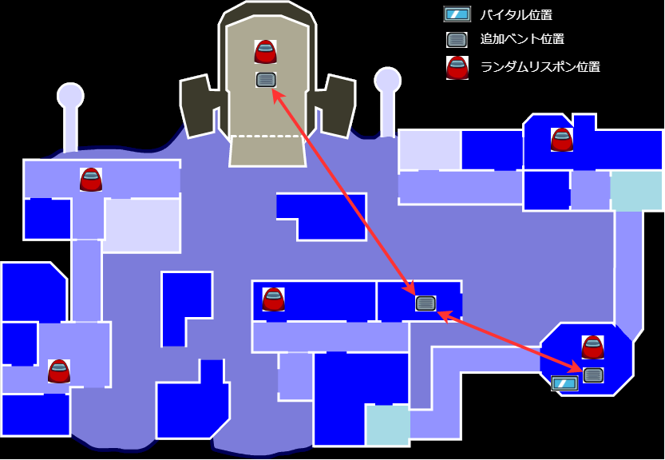
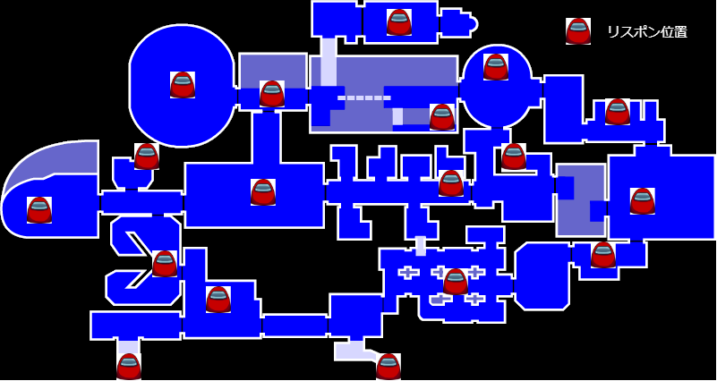
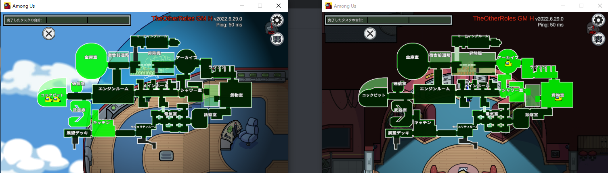
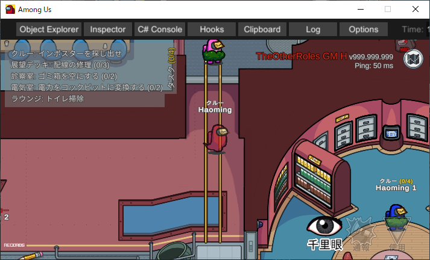
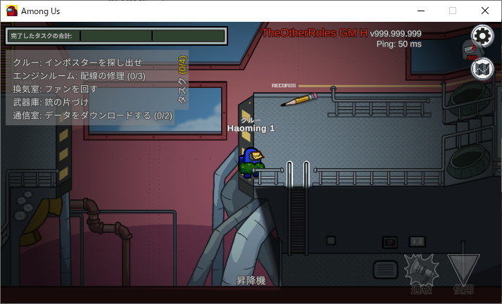
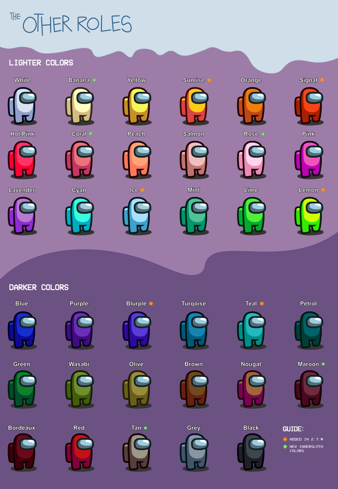

# 联系制作者
)    
基本上在Discord或QQ群上接受提问要求等

# 导入用脚本介绍
使用以下脚本导入似乎很轻松（作者Maximilian先生）  
[AmongUs-Mod-Auto-Deploy-Script](https://github.com/Maximilian2022/AmongUs-Mod-Auto-Deploy-Script)

# 首先说明的事项
本模组与Among Us或Innersloth LLC无关联，其包含的内容也未得到Innersloth LLC的认可或赞助。此处包含的部分素材归Innersloth LLC所有。© Innersloth LLC.

# 'The Other Roles: GM Edition'改造版
因为这个版本存在较多漏洞，所以尝试体验的玩家请做好心理准备。
如果发现了问题，烦请在上述Discord频道中报告。

# 追加功能
- 针对放逐、会议开始和击杀同时发生时的漏洞对策（可选）
- 行动时不停止减少击杀冷却时间（可选）
- 随机化布线任务的顺序（可选）
- 可任意更改布线任务的数量（可选）
- 飞船地图的追加重生位置（可选）
- 飞船地图的随机重生（可选）
- 飞船地图布线任务位置的追加（可选）
- 飞船地图反应堆时间变更（可选）
- 为飞船地图的部分任务添加墙体判定（洗照片、淋浴、垃圾桶）
- 将飞船地图的管理界面恢复为旧设置的功能（可选）
- 飞船地图管理界面显示区域的限制功能（可选）
- 在飞船地图会议室右侧添加只能下行的梯子（可选）
- 将飞船地图会议室左侧的梯子设置为只能上行（可选）
- 飞船地图缺口房间下载位置的变更功能（地图优化选项）
- 从飞船地图缺口房间右侧向下方向添加阴影（地图优化选项） 
- 飞船地图去除“噗嘤”音效的功能
- 飞船地图移除升降机右侧配电盘的功能
- 波勒斯地图的随机重生（可选）
- 波勒斯地图的追加通风口（可选）
- 波勒斯地图生命体征监测位置移动（标本室）
- 死亡时的透视功能（死亡后按G键开启/关闭）

波勒斯地图的改造如以下图片所示
  

飞船地图的追加重生位置如下图所示

飞船地图管理界面限制如下图所示

飞船地图的追加梯子如下图所示

飞船地图去除“噗嘤”音效、移除配电盘、启用地图优化后如下图所示

# 追加职业

| 内鬼 | 船员 | 中立 | 其他 |
| ---- | ---- | ---- | ---- |
| [连环杀手](#连环杀手) | [占卜师](#占卜师) | [狐妖](#狐妖) |  |
| [邪恶黑客（由tomarai制作）](#邪恶黑客) | [幻视者](#幻视者) | [背德者](#背德者) |
| [绝境者](#最后一个内鬼) | [福尔摩斯](#夏洛克) | [薛定谔的猫](#薛定谔的猫) |
| [设陷者](#设陷者) |  | [傀儡师（目前无法使用）](#傀儡师) |
| [双子爆破者](#双子爆破者) |  | [化身博士（测试中）](#化身博士) |  |
| [邪恶追踪者](#邪恶追踪者) |  | [莫里亚蒂](#莫里亚蒂) |  |
| [模仿者](#模仿者) |  | [丘比特](#丘比特) |  |

# GM原版与本改造版的版本对应表
为简化发布，部分表格已省略。 
|  对应 Among Us 版本            | GM本家 | Haoming Edition | 下载                                                                                                                               |
| ----------------------------- | ------ | --------------- | -------------------------------------------------------------------------------------------------------------------------------------- |
| 2024.11.26s                   |        | 最新版          | [下载](https://github.com/FangkuaiYa/TheOtherRoles-GM-Haoming/releases/latest/)
| -                             | -      | -               | -                                                                                                                                      |
| 2022.3.29s                    | v3.5.4 | v2.0.12         | <s>[下载](https://github.com/haoming37/TheOtherRoles-GM-Haoming/releases/download/v2.0.12/TheOtherRoles-GM-Haoming.v2.0.12.zip)</s>   |
| 2022.3.29s                    | v3.5.4 | v2.0.11         | <s>[下载](https://github.com/haoming37/TheOtherRoles-GM-Haoming/releases/download/v2.0.11/TheOtherRoles-GM-Haoming.v2.0.11.zip)</s>   |
| 2022.3.29s                    | v3.5.4 | v2.0.10         | <s>[下载](https://github.com/haoming37/TheOtherRoles-GM-Haoming/releases/download/v2.0.10/TheOtherRoles-GM-Haoming.v2.0.10.zip)</s>   |
| 2022.3.29s                    | v3.5.4 | v2.0.9          | <s>[下载](https://github.com/haoming37/TheOtherRoles-GM-Haoming/releases/download/v2.0.9/TheOtherRoles-GM-Haoming.v2.0.9.zip)</s>     |
| 2022.3.29s                    | v3.5.4 | v2.0.8          | <s>[下载](https://github.com/haoming37/TheOtherRoles-GM-Haoming/releases/download/v2.0.8/TheOtherRoles-GM-Haoming.v2.0.8.zip)</s>     |
| 2022.3.29s                    | v3.5.4 | v2.0.7          | <s>[下载](https://github.com/haoming37/TheOtherRoles-GM-Haoming/releases/download/v2.0.7/TheOtherRoles-GM-Haoming.v2.0.7.zip)</s>     |
| 2022.3.29s                    | v3.5.4 | v2.0.6          | <s>[下载](https://github.com/haoming37/TheOtherRoles-GM-Haoming/releases/download/v2.0.6/TheOtherRoles-GM-Haoming.v2.0.6.zip)</s>     |
| 2022.3.29s                    | v3.5.4 | v2.0.5          | <s>[下载](https://github.com/haoming37/TheOtherRoles-GM-Haoming/releases/download/v2.0.5/TheOtherRoles-GM-Haoming.v2.0.5.zip)</s>     |
| 2022.3.29s                    | v3.5.4 | v2.0.4          | <s>[下载](https://github.com/haoming37/TheOtherRoles-GM-Haoming/releases/download/v2.0.4/TheOtherRoles-GM-Haoming.v2.0.4.zip)</s>     |
| 2022.3.29s                    | v3.5.4 | v2.0.3          | <s>[下载](https://github.com/haoming37/TheOtherRoles-GM-Haoming/releases/download/v2.0.3/TheOtherRoles-GM-Haoming.v2.0.3.zip)</s>     |
| 2022.3.29s                    | v3.5.4 | v2.0.2          | <s>[下载](https://github.com/haoming37/TheOtherRoles-GM-Haoming/releases/download/v2.0.2/TheOtherRoles-GM-Haoming.v2.0.2.zip)</s>     |
| 2022.3.29s                    | v3.5.4 | v2.0.1          | <s>[下载](https://github.com/haoming37/TheOtherRoles-GM-Haoming/releases/download/v2.0.1/TheOtherRoles-GM-Haoming.v2.0.1.zip)</s>     |
| 2022.3.29s                    | v3.5.4 | v2.0.0          | <s>[下载](https://github.com/haoming37/TheOtherRoles-GM-Haoming/releases/download/v2.0.0/TheOtherRoles-GM-Haoming.v2.0.0.zip)</s>     |
| 2022.2.24s                    | v3.5.4 | v1.12.16        | <s>[下载](https://github.com/haoming37/TheOtherRoles-GM-Haoming/releases/download/v1.12.16/TheOtherRoles-GM-Haoming.v1.12.16.zip)</s> |
| 2022.2.24s                    | v3.5.4 | v1.12.14        | <s>[下载](https://github.com/haoming37/TheOtherRoles-GM-Haoming/releases/download/v1.12.14/TheOtherRoles-GM-Haoming.v1.12.14.zip)</s> |
| 2022.2.24s                    | v3.5.4 | v1.12.13        | <s>[下载](https://github.com/haoming37/TheOtherRoles-GM-Haoming/releases/download/v1.12.13/TheOtherRoles-GM-Haoming.v1.12.13.zip)</s> |
| 2022.2.24s                    | v3.5.4 | v1.12.12        | <s>[下载](https://github.com/haoming37/TheOtherRoles-GM-Haoming/releases/download/v1.12.12/TheOtherRoles-GM-Haoming.v1.12.12.zip)</s> |
| 2022.2.24s                    | v3.5.4 | v1.12.11        | <s>[下载](https://github.com/haoming37/TheOtherRoles-GM-Haoming/releases/download/v1.12.11/TheOtherRoles-GM-Haoming.v1.12.11.zip)</s> |
| 2022.2.24s                    | v3.5.4 | v1.12.10        | <s>[下载](https://github.com/haoming37/TheOtherRoles-GM-Haoming/releases/download/v1.12.10/TheOtherRoles-GM-Haoming.v1.12.10.zip)</s> |
| 2022.2.24s                    | v3.5.4 | v1.12.9         | <s>[下载](https://github.com/haoming37/TheOtherRoles-GM-Haoming/releases/download/v1.12.9/TheOtherRoles-GM-Haoming.v1.12.9.zip)</s>   |
| 2022.2.24s                    | v3.5.4 | v1.12.8         | <s>[下载](https://github.com/haoming37/TheOtherRoles-GM-Haoming/releases/download/v1.12.8/TheOtherRoles-GM-Haoming.v1.12.8.zip)</s>   |
| 2022.2.24s                    | v3.5.4 | v1.12.7         | <s>[下载](https://github.com/haoming37/TheOtherRoles-GM-Haoming/releases/download/v1.12.7/TheOtherRoles-GM-Haoming.v1.12.7.zip)</s>   |
| 2022.2.24s                    | v3.5.4 | v1.12.6         | <s>[下载](https://github.com/haoming37/TheOtherRoles-GM-Haoming/releases/download/v1.12.6/TheOtherRoles-GM-Haoming.v1.12.6.zip)</s>   |
| 2022.2.24s                    | v3.5.4 | v1.12.5         | <s>[下载](https://github.com/haoming37/TheOtherRoles-GM-Haoming/releases/download/v1.12.5/TheOtherRoles-GM-Haoming.v1.12.5.zip)</s>   |
| 2022.2.24s                    | v3.5.4 | v1.12.4         | <s>[下载](https://github.com/haoming37/TheOtherRoles-GM-Haoming/releases/download/v1.12.4/TheOtherRoles-GM-Haoming.v1.12.4.zip)</s>   |
| 2022.2.24s                    | v3.5.4 | v1.12.3         | <s>[下载](https://github.com/haoming37/TheOtherRoles-GM-Haoming/releases/download/v1.12.3/TheOtherRoles-GM-Haoming.v1.12.3.zip)</s>   |
| 2022.2.24s                    | v3.5.4 | v1.12.2         | <s>[下载](https://github.com/haoming37/TheOtherRoles-GM-Haoming/releases/download/v1.12.2/TheOtherRoles-GM-Haoming.v1.12.2.zip)</s>   |
| 2022.2.24s                    | v3.5.4 | v1.12.1         | <s>[下载](https://github.com/haoming37/TheOtherRoles-GM-Haoming/releases/download/v1.12.1/TheOtherRoles-GM-Haoming.v1.12.1.zip)</s>   |
| 2022.2.24s                    | v3.5.4 | v1.12.0         | <s>[下载](https://github.com/haoming37/TheOtherRoles-GM-Haoming/releases/download/v1.12.0/TheOtherRoles-GM-Haoming.v1.12.0.zip)</s>   |
| 2022.2.24s                    | v3.5.3 | v1.11.17        | <s>[下载](https://github.com/haoming37/TheOtherRoles-GM-Haoming/releases/download/v1.11.17/TheOtherRoles-GM-Haoming.v1.11.17.zip)</s> |
| 2022.2.24s                    | v3.5.3 | v1.11.16        | <s>[下载](https://github.com/haoming37/TheOtherRoles-GM-Haoming/releases/download/v1.11.16/TheOtherRoles-GM-Haoming.v1.11.16.zip)</s> |
| 2022.2.24s                    | v3.5.3 | v1.11.10        | <s>[下载](https://github.com/haoming37/TheOtherRoles-GM-Haoming/releases/download/v1.11.10/TheOtherRoles-GM-Haoming.v1.11.10.zip)</s> |
| 2022.2.24s                    | v3.5.3 | v1.11.9         | <s>[下载](https://github.com/haoming37/TheOtherRoles-GM-Haoming/releases/download/v1.11.9/TheOtherRoles-GM-Haoming.v1.11.9.zip)</s>   |
| 2022.2.24s                    | v3.5.3 | v1.11.8         | <s>[下载](https://github.com/haoming37/TheOtherRoles-GM-Haoming/releases/download/v1.11.8/TheOtherRoles-GM-Haoming.v1.11.8.zip)</s>   |
| 2022.2.24s                    | v3.5.3 | v1.11.7         | <s>[下载](https://github.com/haoming37/TheOtherRoles-GM-Haoming/releases/download/v1.11.7/TheOtherRoles-GM-Haoming.v1.11.7.zip)</s>   |
| 2022.2.24s                    | v3.5.3 | v1.11.6         | <s>[下载](https://github.com/haoming37/TheOtherRoles-GM-Haoming/releases/download/v1.11.6/TheOtherRoles-GM-Haoming.v1.11.6.zip)</s>   |
| 2022.2.24s                    | v3.5.3 | v1.11.5         | <s>[下载](https://github.com/haoming37/TheOtherRoles-GM-Haoming/releases/download/v1.11.5/TheOtherRoles-GM-Haoming.v1.11.5.zip)</s>   |
| 2022.2.24s                    | v3.5.3 | v1.11.4         | <s>[下载](https://github.com/haoming37/TheOtherRoles-GM-Haoming/releases/download/v1.11.4/TheOtherRoles-GM-Haoming.v1.11.4.zip)</s>   |
| 2022.2.24s                    | v3.5.3 | v1.11.3         | <s>[下载](https://github.com/haoming37/TheOtherRoles-GM-Haoming/releases/download/v1.11.3/TheOtherRoles-GM-Haoming.v1.11.3.zip)</s>   |
| 2022.2.24s                    | v3.5.3 | v1.11.2         | <s>[下载](https://github.com/haoming37/TheOtherRoles-GM-Haoming/releases/download/v1.11.2/TheOtherRoles-GM-Haoming.v1.11.2.zip)</s>   |
| 2022.2.24s                    | v3.5.3 | v1.11.1         | <s>[下载](https://github.com/haoming37/TheOtherRoles-GM-Haoming/releases/download/v1.11.1/TheOtherRoles-GM-Haoming.v1.11.1.zip)</s>   |
| 2022.2.24s                    | v3.5.3 | v1.11.0         | <s>[下载](https://github.com/haoming37/TheOtherRoles-GM-Haoming/releases/download/v1.11.0/TheOtherRoles-GM-Haoming.v1.11.0.zip)</s>   |
| 2022.2.8s                     | v3.5.2 | v1.10.3         | <s>[下载](https://github.com/haoming37/TheOtherRoles-GM-Haoming/releases/download/v1.10.3/TheOtherRoles-GM-Haoming.v1.10.3.zip)</s>   |
| 2022.2.8s                     | v3.5.2 | v1.10.2         | <s>[下载](https://github.com/haoming37/TheOtherRoles-GM-Haoming/releases/download/v1.10.2/TheOtherRoles-GM-Haoming.v1.10.2.zip)</s>   |
| 2022.2.8s                     | v3.5.2 | v1.10.1         | <s>[下载](https://github.com/haoming37/TheOtherRoles-GM-Haoming/releases/download/v1.10.1/TheOtherRoles-GM-Haoming.v1.10.1.zip)</s>   |
| 2022.2.8s                     | v3.5.2 | v1.10.0         | <s>[下载](https://github.com/haoming37/TheOtherRoles-GM-Haoming/releases/download/v1.10.0/TheOtherRoles-GM-Haoming.v1.10.0.zip)</s>   |
| 2022.2.8s                     | v3.5.2 | v1.9.2          | <s>[下载](https://github.com/haoming37/TheOtherRoles-GM-Haoming/releases/download/v1.9.2/TheOtherRoles-GM-Haoming.v1.9.2.zip)</s>     |
| 2022.2.8s                     | v3.5.2 | v1.9.1          | <s>[下载](https://github.com/haoming37/TheOtherRoles-GM-Haoming/releases/download/v1.9.1/TheOtherRoles-GM-Haoming.v1.9.1.zip)</s>     |
| 2022.2.8s                     | v3.5.2 | v1.9.0          | <s>[下载](https://github.com/haoming37/TheOtherRoles-GM-Haoming/releases/download/v1.9.0/TheOtherRoles-GM-Haoming.v1.9.0.zip)</s>     |
| 2021.12.15s (build num: 1421) | v3.5.1 | v1.8.3          | <s>[下载](https://github.com/haoming37/TheOtherRoles-GM-Haoming/releases/download/v1.8.3/TheOtherRoles-GM-Haoming.v1.8.3.zip)</s>     |
| 2021.12.15s (build num: 1421) | v3.5.1 | v1.8.2          | <s>[下载](https://github.com/haoming37/TheOtherRoles-GM-Haoming/releases/download/v1.8.2/TheOtherRoles-GM-Haoming.v1.8.2.zip)</s>     |
| 2021.12.15s (build num: 1421) | v3.5.0 | v1.8.1          | <s>[下载](https://github.com/haoming37/TheOtherRoles-GM-Haoming/releases/download/v1.8.1/TheOtherRoles-GM-Haoming.v1.8.1.zip)</s>     |
| 2021.12.15s (build num: 1421) | v3.5.0 | v1.8.0          | <s>[下载](https://github.com/haoming37/TheOtherRoles-GM-Haoming/releases/download/v1.8.0/TheOtherRoles-GM-Haoming.v1.8.0.zip)</s>     |
| 2021.12.15s (build num: 1421) | v3.5.0 | v1.8.0          | <s>[下载](https://github.com/haoming37/TheOtherRoles-GM-Haoming/releases/download/v1.8.0/TheOtherRoles-GM-Haoming.v1.8.0.zip)</s>     |
| 2021.12.15s (build num: 1421) | v3.4.2 | v1.7.6          | <s>[下载](https://github.com/haoming37/TheOtherRoles-GM-Haoming/releases/download/v1.7.6/TheOtherRoles-GM-Haoming.v1.7.6.zip)</s>     |
| 2021.12.15s (build num: 1421) | v3.4.2 | v1.7.5          | <s>[下载](https://github.com/haoming37/TheOtherRoles-GM-Haoming/releases/download/v1.7.5/TheOtherRoles-GM-Haoming.v1.7.5.zip)</s>     |
| 2021.12.15s (build num: 1421) | v3.4.2 | v1.7.4          | <s>[下载](https://github.com/haoming37/TheOtherRoles-GM-Haoming/releases/download/v1.7.4/TheOtherRoles-GM-Haoming.v1.7.4.zip)</s>     |
| 2021.12.15s (build num: 1421) | v3.4.2 | v1.7.3          | <s>[下载](https://github.com/haoming37/TheOtherRoles-GM-Haoming/releases/download/v1.7.3/TheOtherRoles-GM-Haoming.v1.7.3.zip)</s>     |
| 2021.12.15s (build num: 1421) | v3.4.2 | v1.7.2          | <s>[下载](https://github.com/haoming37/TheOtherRoles-GM-Haoming/releases/download/v1.7.2/TheOtherRoles-GM-Haoming.v1.7.2.zip)</s>     |
| 2021.12.15s (build num: 1421) | v3.4.2 | v1.7.1          | <s>[下载](https://github.com/haoming37/TheOtherRoles-GM-Haoming/releases/download/v1.7.1/TheOtherRoles-GM-Haoming.v1.7.1.zip)</s>     |
| 2021.12.15s (build num: 1421) | v3.4.2 | v1.7.0          | <s>[下载](https://github.com/haoming37/TheOtherRoles-GM-Haoming/releases/download/v1.7.0/TheOtherRoles-GM-Haoming.v1.7.0.zip)</s>     |
| 2021.12.15s (build num: 1421) | v3.4.2 | v1.6.2          | <s>[下载](https://github.com/haoming37/TheOtherRoles-GM-Haoming/releases/download/v1.6.2/TheOtherRoles-GM-Haoming.v1.6.2.zip)</s>     |
| 2021.12.15s (build num: 1421) | v3.4.2 | v1.6.1          | <s>[下载](https://github.com/haoming37/TheOtherRoles-GM-Haoming/releases/download/v1.6.1/TheOtherRoles-GM-Haoming.v1.6.1.zip)</s>     |
| 2021.12.15s (build num: 1421) | v3.4.2 | v1.6.0          | <s>[下载](https://github.com/haoming37/TheOtherRoles-GM-Haoming/releases/download/v1.6.0/TheOtherRoles-GM-Haoming.v1.6.0.zip)</s>     |
| 2021.12.15s (build num: 1421) | v3.4.2 | v1.5.8          | <s>[下载](https://github.com/haoming37/TheOtherRoles-GM-Haoming/releases/download/v1.5.8/TheOtherRoles-GM-Haoming.v1.5.8.zip)</s>     |
| 2021.12.15s (build num: 1421) | v3.4.2 | v1.5.7          | <s>[下载](https://github.com/haoming37/TheOtherRoles-GM-Haoming/releases/download/v1.5.7/TheOtherRoles-GM-Haoming.v1.5.7.zip)</s>     |
| 2021.12.15s (build num: 1421) | v3.4.2 | v1.5.4          | <s>[下载](https://github.com/haoming37/TheOtherRoles-GM-Haoming/releases/download/v1.5.4/TheOtherRoles-GM-Haoming.v1.5.4.zip)</s>     |
| 2021.12.15s (build num: 1421) | v3.4.2 | v1.5.3          | <s>[下载](https://github.com/haoming37/TheOtherRoles-GM-Haoming/releases/download/v1.5.3/TheOtherRoles-GM-Haoming.v1.5.3.zip)</s>     |
| 2021.12.15s (build num: 1421) | v3.4.2 | v1.5.2          | <s>[下载](https://github.com/haoming37/TheOtherRoles-GM-Haoming/releases/download/v1.5.2/TheOtherRoles-GM-Haoming.v1.5.2.zip)</s>     |
| 2021.12.15s (build num: 1421) | v3.4.2 | v1.5.1          | <s>[下载](https://github.com/haoming37/TheOtherRoles-GM-Haoming/releases/download/v1.5.1/TheOtherRoles-GM-Haoming.v1.5.1.zip)</s>     |
| 2021.12.15s (build num: 1421) | v3.4.2 | v1.5.0          | <s>[下载](https://github.com/haoming37/TheOtherRoles-GM-Haoming/releases/download/v1.5.0/TheOtherRoles-GM-Haoming.v1.5.0.zip)</s>     |
| 2021.12.15s (build num: 1421) | v3.4.2 | v1.4.0          | <s>[下载](https://github.com/haoming37/TheOtherRoles-GM-Haoming/releases/download/v1.4.0/TheOtherRoles-GM-Haoming.v1.4.0.zip)</s>     |
| 2021.12.15s (build num: 1421) | v3.4.2 | v1.3.0          | <s>[下载](https://github.com/haoming37/TheOtherRoles-GM-Haoming/releases/download/v1.3.0/TheOtherRoles-GM-Haoming.v1.3.0.zip)</s>     |
| 2021.12.15s (build num: 1421) | v3.4.2 | v1.2.1          | <s>[下载](https://github.com/haoming37/TheOtherRoles-GM-Haoming/releases/download/v1.2.1/TheOtherRoles-GM-Haoming.v1.2.1.zip)</s>     |
| 2021.12.15s (build num: 1421) | v3.4.2 | v1.2.0          | <s>[下载](https://github.com/haoming37/TheOtherRoles-GM-Haoming/releases/download/v1.2.0/TheOtherRoles-GM-Haoming.v1.2.0.zip)</s>     |
| 2021.12.15s (build num: 1421) | v3.4.2 | v1.1.0          | <s>[下载](https://github.com/haoming37/TheOtherRoles-GM-Haoming/releases/download/v1.1.0/TheOtherRoles-GM-Haoming.v1.1.0.zip)</s>     |
| 2021.12.15s (build num: 1421) | v3.4.2 | v1.0.1          | <s>[下载](https://github.com/haoming37/TheOtherRoles-GM-Haoming/releases/download/v1.0.1/TheOtherRoles-GM-Haoming.v1.0.1.zip)</s>     |
| 2021.12.15s (build num: 1421) | v3.4.2 | v1.0.0          | <s>[下载](https://github.com/haoming37/TheOtherRoles-GM-Haoming/releases/download/v1.0.0/TheOtherRoles-GM-Haoming.v1.0.0.zip)</s>     |

# 职业列表

### 邪恶黑客
- 【从tomarai氏的TOR分支移植】(https://github.com/tomarai/TheOtherRoles) 
- 注：移植工作由鸣海氏进行。
- 可随时查看管理面板。
- 在选项设置中开启后，能够将任意玩家设为叛徒。
- 若在选项中设置为无法将狐妖、豺狼设为叛徒，此时按钮会消耗，但目标玩家仍保持狐妖、豺狼身份。
- 若将拥有跟班的狐妖设为叛徒，背德者将会死亡。

| 选项名 | 说明 |
| ---- | ---- |
| 可指定叛徒 | 开启后可指定叛徒 |
| 可将狐妖设为叛徒 | 开启后可将狐妖设为叛徒 |
| 可将豺狼设为叛徒 | 开启后可将豺狼设为叛徒 |
| 警长可杀死叛徒 | 开启后警长能杀死其创建的叛徒 |
| 叛徒可进入通风口 | 开启后创建的叛徒能够进入通风口 |
| 叛徒与内鬼视野相同 | 开启后创建的叛徒拥有与内鬼相同的视野 |
| 叛徒可进行破坏行动 | 开启后创建的叛徒能够进行破坏行动 |
| 叛徒可修复通讯破坏 | 开启后创建的叛徒能够修复通讯破坏 |
| 叛徒完成任务时可得知内鬼身份 | 开启后，任务完成时内鬼名字会以红色文字显示 |
| 叛徒被放逐时可带走一名船员 | 开启后，叛徒被放逐时可随机带走一名船员同伴 |

### 连环杀手
- 注：已预定给GM（管理员）。
- 属于内鬼阵营。
- 拥有独立的击杀冷却时间设定（建议设置在15秒至20秒左右）。
- 每次击杀后，倒计时开始，倒计时归零便会自杀。
- 进行击杀或召开会议会重置倒计时。
- 建议倒计时设置为40至50秒左右。
- 由于会议结束后有击杀冷却时间，若倒计时设为40秒，击杀冷却时间设为15秒，那么实际可击杀时间仅为25秒。

### 绝境者
- 注：目前正在调整中。
- 今后计划增加能力的多样性。
- 目前基本仅适用于狐妖村模式。
- 属于内鬼阵营。
- 是最后一名存活的内鬼所获得的职业。
- 获得该职业后，完成一定击杀数可进行占卜。
- 占卜与2号占卜师类似，可咒杀狐妖，因此能配合背德者自爆实现双杀（还可配合普通击杀尝试三杀）。
- 向着在5人局中一举获胜的目标努力。

| 选项名 | 说明 |
| ---- | ---- |
| 绝境者生效 | 开启后绝境者生效 |
| 绝境者生效时的能力 | 可选择灵媒或占卜能力 |
| 发动能力所需的击杀数 | 完成设定的击杀数后，屏幕右下角会出现一个一次性可用的占卜按钮 |
| 占卜结果为船员与非船员 | 开启后，占卜结果为船员与非船员二选一；关闭则显示职业名 |
| 灵媒子弹数 | 选择灵媒时可发动能力的次数 |

### 设陷者
- 注：因为选项较多，日后会详细检查。
- 是可以设置陷阱进行击杀的内鬼。
- 只能设置一个陷阱，设置第二个陷阱时，第一个会消失。
- 陷阱击杀和普通击杀，无论进行哪一种，都会同时进入冷却时间。
- 陷阱在设置、发动、击杀时，会在设定距离内发出音效。（仅设置时音效有效距离为2/3）
- 陷阱准备时间内若有人按下会议按钮，设陷者会立即死亡。
- 陷阱设置后经过一定时间生效（生效前所有人可见，生效后仅内鬼和狐妖可见）。
- 进入陷阱一定范围内的玩家会无法移动，经过一定时间后死亡。
- 死亡前，其他玩家可解除陷阱（与玩家重叠即可解除）。
- 陷阱解除后，陷阱设置与普通击杀都会进入冷却时间（有惩罚）。
- 进行陷阱击杀或普通击杀，会延长惩罚时间的冷却（不累积）。
- 仅在陷阱发动时击杀玩家，会缩短奖励时间的冷却（不累积）。

| 选项名 | 说明 |
| ---- | ---- |
| 设置后生效所需时间 | 陷阱生效前的时间，在此期间船员可看到陷阱 |
| 陷阱冷却时间 | 设置陷阱所需的冷却时间 |
| 陷阱发动后至击杀的缓冲时间 | 发动到击杀所需的时间，此期间可解除陷阱 |
| 陷阱有效范围 | 陷阱发动的范围（建议设为1左右，有一定吸附效果） |
| 音效衰减起始距离 | 音效开始衰减的距离 |
| 音效衰减结束距离 | 音效完全听不见的距离（建议5 - 8左右） |
| 普通击杀时的惩罚时间 | 陷阱击杀、解除、普通击杀时，冷却时间增加的时长 |
| 陷阱击杀时的奖励时间 | 击杀陷入陷阱的玩家，冷却时间缩短的时长 |

### 双子爆破者
- 注：特效开启时，会议结束后可能会黑屏，若出现此情况请关闭特效。
- 是双人内鬼组合。
- 以与投弹手相同的方式设置炸弹。
- 两人设置炸弹后，处于一定距离内可引爆炸弹，击杀一名玩家（仅先按下爆破按钮的对象所针对的玩家会被击杀）。
- 双方都设置炸弹后，会显示箭头，以便知晓对方位置。
- 若一方死亡，剩下一人变为普通内鬼。

| 选项名 | 说明 |
| ---- | ---- |
| 炸弹冷却时间 | 设置炸弹的冷却时间 |
| 炸弹设置时间 | 设置炸弹所需时间 |
| 计为一名内鬼 | 两人计为一名内鬼 |
| 击杀时显示特效 | 可能有漏洞的功能，击杀时在尸体旁显示爆破特效 |
| 一人死亡则两人皆死 | 一方死亡，另一方也死亡 |
| 投票变为1票 | 双子爆破者其中一人的投票不被计数 |

### 邪恶的追踪者
- 注：测试中，若有漏洞请报告。
- 该职业能掌握己方内鬼的行动。
- 己方内鬼位置会显示箭头。
- 己方内鬼击杀时，会显示击杀闪光（可选）。
- 可指定任意玩家显示箭头。

| 选项名 | 说明 |
| ---- | ---- |
| 追踪者冷却时间 | 追踪者指定目标的冷却时间 |
| 会议后可重新设定目标 | 目标可重新指定，开启或关闭此功能 |
| 可查看内鬼击杀的死亡闪光 | 开启或关闭击杀闪光功能 |

### 模仿者
模仿者是双人内鬼职业。
- 杀手在击杀时可消除尸体，并变身为被击杀对象（杀手在下一次会议前无法解除变身）。
- 杀手朝向助手时会显示箭头。若箭头颜色为白色，说明助手变身为杀手。
- 助手没有击杀能力，但有制造杀手不在场证明的能力。
- 杀手击杀时，助手可看到闪光。
- 助手拥有便携式管理面板。
- 助手朝向杀手时会显示箭头。
- 助手可变身为杀手。

| 选项名 | 说明 |
| ---- | ---- |
| 计为一名内鬼 | 两人计为一名内鬼 |
| 一人死亡则两人皆死 | 任何一方死亡，两人都死亡 |
| 两人计为一票 | 两人存活时，模仿者助手的投票不被计数 |

### 占卜师
- 属于船员阵营。
- 只能占卜一次。
- 完成一定数量的任务后才能被识别为占卜师。
- 被识别后无法按下会议按钮。
- 任务中可占卜，且结果即时可知。
- 占卜后，内鬼会看到指向占卜师的箭头。
- 可占卜的对象仅限一定时间内、一定距离内接触过的玩家，或已死亡的玩家。
- 占卜背德者，背德者会收到通知。
- 占卜狐妖可将其咒杀。
- 占卜结果可在选项中设置为显示职业名，或仅显示是否为船员。

| 选项名 | 说明 |
| ---- | ---- |
| 占卜所需任务数 | 可自曝为占卜师并进行占卜所需完成的任务数 |
| 占卜结果仅黑白显示 | 开启后，占卜结果仅显示是否为船员；关闭则显示职业名 |
| 接触时间 | 占卜存活玩家所需的接触时间（累积计算） |
| 接触判定距离 | 接触时间更新所需的距离 |

**行动策略**：成为占卜师后就表明身份的占卜师，应在下次任务阶段开始时立即占卜（一边祈祷其他船员帮忙按按钮，一边逃跑）。

### 幻视者
- 属于船员阵营的边缘职业。
- 自身显示为船员同伴。
- 随机对队友的视觉认知出现异常（第一天100%正常）。

| 选项名 | 说明 |
| ---- | ---- |
| 外观互换概率 | 会议结束后，出现外观互换的概率 |
| 外观互换人数 | 会议结束后，外观发生互换的人数 |

### 福尔摩斯
福尔摩斯是具有调查能力的船员职业。
- 完成一些任务后，可使用调查能力。
- 使用调查技能时，若过去该范围内发生过事件，可找到是哪个阵营犯下罪行的证据。

| 选项名 | 说明 |
| ---- | ---- |
| 调查冷却时间 | 调查按钮的冷却时间 |
| 调查所需任务数 | 可按下调查按钮所需完成的任务数 |
| 调查范围 | 可进行调查的范围 |

### 狐妖
- 属于第三方阵营。
- 完成所有任务并存活到最后，游戏结束时可单独获胜（其他第三方阵营单人获胜情况除外）。
- 狐妖不计入船员存活人数。
- 狐妖有专属任务。
- 可通过箭头知晓能杀死自己的玩家位置（警长、内鬼、豺狼）。
- 按下透明化按钮，可在一定时间内透明且无法被选为目标，但透明期间无法做任务。
- 狐妖无法修复反应堆。
- 可将除能杀死自己的玩家外的其他人变为背德者（可在选项中开启或关闭）。
- 狐妖的任务数不计入船员任务数（狐妖未完成任务，船员也可能获胜）。
- 狐妖完成任务且存活，同时存活船员任务全部完成时，狐妖获胜（防止幽灵故意停止任务）。
- 可在选项中设置豺狼能否将狐妖变为跟班，狐妖成为跟班时，背德者死亡。
- 完成监控室任务时，狐妖和背德者会看到箭头。

| 选项名 | 说明 |
| ---- | ---- |
| 任务数 | 分配给狐妖的任务数量 |
| 停留时间 | 完成狐妖专属任务所需时间 |
| 任务类型 | 选择连续，则如布线任务般依次进行；选择并列，则可按任意顺序进行任务 |
| 优先船员任务胜利 | 开启后船员可通过完成任务获胜 |
| 内鬼可通过破坏获胜 | 开启后内鬼可通过破坏行动获胜 |
| 透明冷却时间 | 发动透明能力所需的冷却时间 |
| 透明时间 | 可保持透明的时间 |
| 透明中可修复破坏 | 开启后透明期间可修复破坏行动 |
| 可制造背德者 | 开启后可制造背德者 |

**行动策略**：
- 知晓杀手阵营并躲避以避免死亡（必要时使用透明能力）。
- 利用背德者修复破坏行动，避免被船员怀疑。
- 牢记上述要点，尽快完成任务。

### 背德者
- 作为狐妖的跟班。
- 狐妖死亡时，背德者也死亡。
- 拥有以下三种能力：
- 显示指向狐妖方向的箭头。
- 可通过自杀按钮自杀。
- 可看到击杀闪光。

**行动策略**：
- 代替狐妖修复破坏行动，让狐妖看似完成修复。
- 不修复破坏行动，佯装狐妖，代替其被投票出局。
- 在击杀闪光时机自杀，伪装成狐妖已死。

### 薛定谔的猫
- 属于第三方阵营。
- 默认无胜利条件，满足条件后才拥有胜利条件。
1. 被内鬼击杀后，以内鬼阵营身份复活。
2. 被豺狼击杀后，以豺狼阵营身份复活。
3. 被船员投票放逐后，以船员阵营身份死亡。
4. 被警长/占卜师击杀后，以船员阵营身份复活。
- 占卜师可通过占卜咒杀薛定谔的猫。
- 不属于任何阵营时，以船员阵营身份复活；属于某个阵营时，直接死亡。

| 选项名 | 说明 |
| ---- | ---- |
| 击杀冷却时间 | 以豺狼、内鬼身份复活后的击杀冷却时间 |
| 代替叛徒成为内鬼 | 开启后以内鬼阵营身份复活时变为内鬼 |
| 杀手死亡 | 击杀薛定谔的猫的玩家死亡（船员阵营除外） |
| 最后一人前无法击杀 | 变为内鬼、豺狼阵营后，在成为最后一人前无法击杀 |
| 放逐时随机加入阵营 | 放逐时随机加入内鬼、豺狼、船员阵营其中之一 |

### 傀儡师
- 注：测试中，若有漏洞请报告。
- 可通过接触玩家获取样本，制作并操控与该玩家外观相同的假人。
- 制作的假人被击杀或样本原玩家被放逐，可获得1分。
- 分数达到设定值时，傀儡师获胜。
- 傀儡师死亡时，能力会有部分变化：
1. 样本对象被投票出局时，无法获得1分。
2. 假人被破坏时，样本对象不会死亡。

**其他说明**：
- 会议结束后，需10秒才能再次进行样本采集。
- 与投弹手方式相同获取样本，获取后按钮图标变为假人。
- 使用假人按钮可生成与样本对象外观相同且可操控的假人。
- 生成假人后，按下假人按钮可在自身与假人操控间切换。
- 切换假人操控时，假人始终从玩家位置开始。
- 操控假人时，自身透明；操控自身时，假人透明。
- 假人可通过WASD移动，E/SPACE上下梯子、开门。
- 操控假人时，视角为千里眼（范围稍窄）。
- 假人被破坏后，可再次获取样本并生成假人。
- 假人被击杀时，样本原玩家死亡。
- 仅警长击杀时，样本原玩家的替身傀儡师死亡。
- 显示可击杀玩家的箭头（与狐妖相同）。
- 显示指向假人复制源的箭头（紫色箭头）。
- 样本为内鬼、豺狼时，其被放逐不计入得分。
- 有假人击杀时，会议开始会播放笑声音效。
- 傀儡师死亡时，会议期间会向杀手阵营发送傀儡师进度信息。

| 选项名 | 说明 |
| ---- | ---- |
| 胜利所需分数 | 胜利所需分数，假人被击杀或样本原玩家被放逐，分数加1 |
| 样本获取所需时间 | 获取样本所需的接触时间 |
| 死亡后仍可操控假人 | 开启后死亡仍可操控假人，样本原玩家被放逐时不加分 |
| 死亡惩罚 | 死亡时失去的分数 |
| 死亡时失去千里眼能力 | 死亡后操控假人时无法使用千里眼能力 |

### 化身博士
化身博士是具有特殊胜利条件的第三方阵营。
- 化身博士通过击杀设定数量的玩家获胜。
- 最初随机决定为杰基尔或海德，每减少一人，化身博士形态切换。

**杰基尔**：
1. 可做任务，完成一定数量任务可获得药物。
2. 被其他玩家技能作用时，判定为船员。

**海德**：
1. 可击杀玩家。
2. 有自杀倒计时。

**药物**：
1. 使用后可在任意时机切换一次化身博士形态。

| 选项名 | 说明 |
| ---- | ---- |
| 胜利所需击杀数 | 胜利所需的击杀数 |
| 击杀冷却时间 | 击杀冷却时间 |
| 自杀倒计时 | 海德形态下，自杀前的倒计时 |
| 会议后重置自杀倒计时 | 会议后是否重置自杀倒计时 |
| 普通任务 | 普通任务 |
| 长任务 | 长任务 |
| 短任务 | 短任务 |
| 获得药物所需任务数 | 获得1个药物所需完成的任务数 |

### 莫里亚蒂
莫里亚蒂属于第三方阵营，拥有类似豺狼的特殊胜利条件。他能够洗脑一名玩家，并让被洗脑的玩家去杀害其他玩家。

莫里亚蒂必须满足两个胜利条件：
1. 存活到最后。
2. 使其他玩家被杀害N次（N由选项决定）。

莫里亚蒂可以与被洗脑的玩家一同游戏（不过，只有莫里亚蒂能获胜）。
例如：两名普通船员、一名被洗脑的船员、莫里亚蒂 => 莫里亚蒂获胜。
若内鬼、豺狼、化身博士仍存活，则游戏继续。

| 选项名 | 说明 |
| ---- | ---- |
| 洗脑冷却时间 | 洗脑按钮的冷却时间 |
| 洗脑有效时间 | 洗脑效果持续的时间 |
| 洗脑所需时间 | 进行洗脑所需的接触时间 |
| 胜利所需击杀数 | 获胜所需的击杀次数 |
| 洗脑距离 | 能够进行洗脑的距离 |
| 击杀距离 | 被洗脑者能够进行击杀的距离 |

### 丘比特
丘比特可以指定任意两人成为“恋人”（在任务阶段选择，会议结束后生效）。若自己选定的“恋人”能存活到最后，丘比特便获得胜利。
- 若在一定时间内未完成选定，丘比特会自杀。
- 若自己选定的两名对象中有一人死亡，丘比特随后会自杀。
- 丘比特不会被选为（普通的）“恋人”。
- 若将（普通的）“恋人”中的一方选为丘比特的“恋人”，那么剩下的一人会在会议结束后死亡（不会留下尸体）。
- 丘比特可以给任意对象赋予护盾（可选功能）。
- 若被赋予护盾的对象被击杀，丘比特会代替其死亡。
- 被赋予护盾的对象无法察觉自己已被击杀。

| 选项名 | 说明 |
| ---- | ---- |
| 选择搭档的时间限制 | 在限制时间内未选定两名搭档，丘比特将自杀 |
| 护盾生效 | 开启或关闭护盾能力 |

### 鸣谢
“邪恶黑客”的创意与代码  
[tomarai/TheOtherRoles](https://github.com/tomarai/TheOtherRoles)

线路位置添加的创意与代码  
出生点添加、出生点同步的创意与代码  
[Dolly1016/Nebula](https://github.com/Dolly1016/Nebula)

抽奖处理偏差排除的创意与代码  
[yukieiji/ExtremeRoles](https://github.com/yukieiji/ExtremeRoles.git)

数据对象序列化  
[Newtonsoft.Json](https://github.com/JamesNK/Newtonsoft.Json)

↓以下为本作原版的README文件内容↓ 
# The Other Roles: GM Edition

此分支对[超多职业](https://github.com/Eisbison/TheOtherRoles)进行多种优化和修改

### 全新职业
- **管理员（GM）** - 由[Virtual_Dusk](https://twitter.com/Virtual_Dusk)创作
- **叛徒（Madmate）** - 由[tomarai](https://github.com/tomarai)创作
- **投机者（Opportunist）** - 由[libhalt](https://twitter.com/libhalt)创作
- **忍者（Ninja）** - 由[Virtual_Dusk](https://twitter.com/Virtual_Dusk)创作
- **邪恶的赌怪（Evil Swapper）** - 由[Virtual_Dusk](https://twitter.com/Virtual_Dusk)创作
- **连锁变换者（Chain-Shifter）** - 由[Virtual_Dusk](https://twitter.com/Virtual_Dusk)创作
- **疫医（Plague Doctor）** - 由[haoming37](https://github.com/haoming37)创作
- **连环杀手（Serial Killer）** - 由[haoming37](https://github.com/haoming37)创作
- **复仇者（Neko-Kabocha）** - 由[Virtual_Dusk](https://twitter.com/Virtual_Dusk)创作
- **狐妖与背德者（Fox & Immoralist）** - 由[haoming37](https://github.com/haoming37)创作
- **占卜师（Fortune Teller）** - 由[haoming37](https://github.com/haoming37)创作
- **窥视者（Watcher）** - 由[Virtual_Dusk](https://twitter.com/Virtual_Dusk)创作
### 复数职业
- 恋人（最多7对）
- 警长
- 以及更多……
### 翻译
支持翻译为Among Us所支持的任意语言
### 自定义帽子
- 近90款全新帽子，由日本Among Us社区成员绘制

本模组与Among Us或InnerSloth有限责任公司无关联，其所含内容也未得到InnerSloth有限责任公司的认可或赞助。本模组所含部分素材归InnerSloth有限责任公司所有。© InnerSloth有限责任公司。 

# 超多职业

**超多职业**, 是一个为 [Among Us](https://store.steampowered.com/app/945360/Among_Us) 设计的模组，添加多种职业, [设置](#settings), 和 [自定义帽子](#custom-hats).
更多的职业正在向你奔来 :)

| 内鬼阵营职业 | 船员阵营职业 | 中立阵营职业 | 其他 |
| ---- | ---- | ---- | ---- |
| [邪恶迷你船员](#迷你船员) | [善良迷你船员](#迷你船员) | [纵火犯](#纵火犯) | [管理员](#管理员) |
| [邪恶的赌怪](#赌怪) | [正义的赌怪](#赌怪) | [小丑](#小丑) |  |
| [赏金猎人](#赏金猎人) | [侦探](#侦探) | [豺狼](#豺狼) |  |
| [隐蔽者](#隐蔽者) | [工程师](#工程师) | [跟班](#跟班) |  |
| [清理者](#清理者) | [黑客](#黑客) | [恋人](#恋人) |  |
| [抹除者](#抹除者) | [执灯人](#执灯人) | [投机者](#投机者) |  |
| [教父（黑手党）](#黑手党) | [市长](#市长) | [秃鹫](#秃鹫) |  |
| [小弟（黑手党）](#黑手党) | [医生](#医生) | [律师](#律师) |  |
| [清洁工（黑手党）](#黑手党) | [保安](#保安) | [连环交换师](#连环交换师) |  |
| [化形者](#化形者) | [灵媒](#灵媒) | [疫医](#疫医) |  |
| [骗术师](#骗术师) | [警长](#警长) | [狐妖与背德者](#狐妖与背德者) |  |
| [吸血鬼](#吸血鬼) | [化形者](#化形者) |  |  |
| [术士](#术士) | [告密者](#告密者) |  |  |
| [女巫](#女巫) | [卧底](#卧底) |  |  |
| [忍者](#忍者) | [正义的换票师](#换票师) |  |  |
| [邪恶的赌怪](#邪恶的赌怪) | [时间之主](#时间之主) |  |  |
| [连环杀手](#连环杀手) | [追踪者](#追踪者) |  |  |
| [复仇者](#复仇者) | [诱饵](#诱饵) |  |  |
| [邪恶的窥视者](#邪恶的窥视者) | [叛徒](#叛徒) |  |  |
|  | [通灵师](#通灵师) |  |  |
|  | [占卜师](#占卜师) |  |  |
|  | [善良窥视者](#善良窥视者) |  |  | 

[职业分配](#role-assignment) 介绍了这些职业在玩家中是如何分配的.

# Releases
| 对应 Among Us 版本            |  Mod 版本    | 链接                                                                                                                  |
| ----------------------------- | ----------- | --------------------------------------------------------------------------------------------------------------------- |
| 2024.11.26s                   | v24.11.26.1 | [下载](https://github.com/JieGeLovesDengDuaLang/TheOtherRoles-GM/releases/download/v24.11.26.1/TheOtherRolesGM.dll)     |
| 2022.2.24s                    | v3.5.4 GM   | [下载](https://github.com/yukinogatari/TheOtherRoles-GM/releases/download/v3.5.4/TheOtherRoles-GM.v3.5.4.zip)     |
| 2022.2.24s                    | v3.5.3 GM   | [下载](https://github.com/yukinogatari/TheOtherRoles-GM/releases/download/v3.5.3/TheOtherRoles-GM.v3.5.3.zip)     |
| 2022.2.8s                     | v3.5.2 GM   | [下载](https://github.com/yukinogatari/TheOtherRoles-GM/releases/download/v3.5.2/TheOtherRoles-GM.v3.5.2.zip)     |
| 2021.12.15s (build num: 1421) | v3.5.1 GM   | [下载](https://github.com/yukinogatari/TheOtherRoles-GM/releases/download/v3.5.1/TheOtherRoles-GM.v3.5.1.zip)     |
| 2021.12.15s (build num: 1421) | v3.5.0 GM   | [下载](https://github.com/yukinogatari/TheOtherRoles-GM/releases/download/v3.5.0/TheOtherRoles-GM.v3.5.0.zip)     |
| 2021.12.15s (build num: 1421) | v3.4.1 GM   | [下载](https://github.com/yukinogatari/TheOtherRoles-GM/releases/download/v3.4.1/TheOtherRoles-GM.v3.4.1.zip)     |
| 2021.12.15s (build num: 1421) | v3.4.0 GM   | [下载](https://github.com/yukinogatari/TheOtherRoles-GM/releases/download/v3.4.0/TheOtherRoles-GM.v3.4.0.zip)     |
| 2021.12.15s (build num: 1421) | v3.3.3.1 GM | [下载](https://github.com/yukinogatari/TheOtherRoles-GM/releases/download/v3.3.3.1/TheOtherRoles-GM.v3.3.3.1.zip) |
| 2021.12.15s (build num: 1421) | v3.3.2 GM   | [下载](https://github.com/yukinogatari/TheOtherRoles-GM/releases/download/v3.3.2/TheOtherRoles-GM.v3.3.2.zip)     |
| 2021.12.15s (build num: 1421) | v3.3.1 GM   | [下载](https://github.com/yukinogatari/TheOtherRoles-GM/releases/download/v3.3.1/TheOtherRoles-GM.v3.3.1.zip)     |
| 2021.12.15s (build num: 1421) | v3.3.0 GM   | [下载](https://github.com/yukinogatari/TheOtherRoles-GM/releases/download/v3.3.0/TheOtherRoles-GM.v3.3.0.zip)     |
| 2021.12.15s (build num: 1421) | v3.2.6 GM   | [下载](https://github.com/yukinogatari/TheOtherRoles-GM/releases/download/v3.2.6/TheOtherRoles-GM.v3.2.6.zip)     |
| 2021.12.14s (build num: 1402) | v3.2.5.3 GM | [下载](https://github.com/yukinogatari/TheOtherRoles-GM/releases/download/v3.2.5.3/TheOtherRoles-GM.v3.2.5.3.zip) |
| 2021.11.9.5s                  | v3.2.5.2 GM | [下载](https://github.com/yukinogatari/TheOtherRoles-GM/releases/download/v3.2.5.2/TheOtherRoles-GM.v3.2.5.2.zip) |
| 2021.11.9.5s                  | v3.2.5.1 GM | [下载](https://github.com/yukinogatari/TheOtherRoles-GM/releases/download/v3.2.5.1/TheOtherRoles-GM.v3.2.5.1.zip) |
| 2021.11.9.5s                  | v3.2.5 GM   | [下载](https://github.com/yukinogatari/TheOtherRoles-GM/releases/download/v3.2.5/TheOtherRoles-GM.v3.2.5.zip)     |
| 2021.11.9.5s                  | v3.2.4 GM   | [下载](https://github.com/yukinogatari/TheOtherRoles-GM/releases/download/v3.2.4/TheOtherRoles-GM.v3.2.4.zip)     |
| 2021.11.9.5s                  | v3.2.3 GM   | [下载](https://github.com/yukinogatari/TheOtherRoles-GM/releases/download/v3.2.3/TheOtherRolesGM.dll)             |
| 2021.11.9.5s                  | v3.2.2 GM   | [下载](https://github.com/yukinogatari/TheOtherRoles-GM/releases/download/3.2.2/TheOtherRoles-GM.v3.2.2.zip)      |
| 2021.11.9.5s                  | v3.1.2.1 GM | [下载](https://github.com/yukinogatari/TheOtherRoles-GM/releases/download/v3.1.2.1/TheOtherRoles-GM.v3.1.2.1.zip) |
| 2021.11.9.5s                  | v3.1.2 GM   | [下载](https://github.com/yukinogatari/TheOtherRoles-GM/releases/download/v3.1.2/TheOtherRoles-GM.v3.1.2.zip)     |
| 2021.6.30s                    | v2.9.2.1 GM | [下载](https://github.com/yukinogatari/TheOtherRoles-GM/releases/download/v2.9.2.1/TheOtherRoles-GM.v2.9.2.1.zip) |
| 2021.6.30s                    | v2.9.2 GM   | [下载](https://github.com/yukinogatari/TheOtherRoles-GM/releases/download/v2.9.2/TheOtherRoles-GM.v2.9.2.zip)     |
| 2021.6.30s                    | v2.9.0.1 GM | [下载](https://github.com/yukinogatari/TheOtherRoles-GM/releases/download/v2.9.0/TheOtherRoles-GM.v2.9.0.1.zip)   |

# Changelog

  
点击显示更新日志(TOR本家-机翻)

### 版本3.4.3
- 修复了“赌怪为内鬼几率”导致职业系统崩溃的漏洞。
- 修复了被附带的黑客职业被困住的漏洞。
- 修复了被附带的保安职业被困住的漏洞。
- 修复了禁用的报告按钮触发手铐的漏洞。
- 修复了邪恶的赌怪生成率不正确的漏洞。
- 修改为清理者与秃鹫职业相互排斥。
- 修改为可显示死亡时颜色变浅/变深的指示器。

### 版本3.4.2
- 修复了一个严重影响游戏的漏洞。

### 版本3.4.2
- 修复了一个严重影响游戏的漏洞。

### 版本3.4.1
- 为会议添加了新的模组选项“显示颜色变浅/变深”。
- 增加了选择哪些地图可用于随机地图的选项，感谢[EvilScum](https://github.com/JustASysAdmin)。
- 为小丑添加选项“小丑拥有内鬼视野”，感谢[EvilScum](https://github.com/JustASysAdmin)。
- 修复了赏金猎人没有赏金目标的漏洞。
- 修复了赌怪与警长分配不当的漏洞（但愿这次修好了）。
- 修复了黑客按钮在“随机地图”选项下无法正常工作的漏洞。
- 修复了保安在“飞船（Skeld）”、“反飞船（dlekS）”和“飞艇（Airship）”地图上无法使用监控摄像头的漏洞。
- 将追踪者的更新间隔改为至少1，感谢[LaicosVK](https://github.com/LaicosVK)。

### 版本3.4.0
- 添加新职业[捕快（Deputy）](#deputy)，感谢[gendelo3](https://github.com/gendelo3)。
- 为黑客添加选项“使用移动设备期间无法移动”。
- 在安装完所有螺丝后，为保安添加移动监控摄像头功能。
- 为恋人添加选项“启用恋人聊天”。
- 在会议中添加返回选票机制：如果你的目标被赌怪射杀，你现在将拿回你的选票。
- 为赌怪添加新选项：如果告密者完成了所有任务，赌怪不能猜告密者（由[MaximeGillot](https://github.com/MaximeGillot)创建）。
- 添加其他职业更新日志公告弹窗。
- 修改为赏金猎人排除自己的恋人作为目标。
- 调整了会议中女巫图标的位置，以提高可见度。
- 修复了卧底在聊天中对内鬼显示白色名字的漏洞。
- 修复了会议中赌怪和换票师的用户界面显示在护目镜装饰后面的漏洞。

### 版本3.3.3
- 修复了被猜中的赌怪仍能猜测的漏洞。
- 修复了会议期间按钮可见的漏洞。
- 移除了“飞船（Skeld）”和“反飞船（dlekS）”地图上黑客的生命体征监测功能。
- 将赌怪选项“其他赌怪生成率”改为“两个赌怪生成率”（现在仅在第一个赌怪生成成功的情况下生效）。
- 将“MIRA总部”地图上黑客的生命体征监测功能改为门禁日志功能。

### 版本3.3.2
- 修复了在Among Us2021.12.15版本中无法创建大厅的漏洞。

### 版本3.3.1
- 修复了有时邪恶的赌怪无法猜测的漏洞。感谢@tomarai。

### 版本3.3.0
- 更新至Among Us2021.12.14s版本。
- 修复了起诉人在作为最后一个被击杀或投票出局的玩家时仍能获胜的漏洞。
- 修复了“启用模组职业并禁用原版职业”选项设置不正确的漏洞。
- 为赌怪添加新选项“邪恶的赌怪可以猜卧底”。
- 为赌怪添加新选项“其他赌怪生成率”。
- 为黑客添加新能力“移动设备”（包括生命体征监测和管理面板）。
- 为黑客添加新选项“移动设备最大充能次数”。
- 为黑客添加新选项“充能所需任务数量”。
- 修复了会议期间的一些用户界面漏洞。

### 版本3.2.5（管理员）
- 允许单独隐藏名牌。
- 变换者变换失败现在标记为自杀。
- 修复律师被投票出局时窃取胜利的漏洞。
- 修复玩家有时衣服/名字互换的问题。
- 在会议屏幕上隐藏击杀按钮。
- 修复非吸血鬼/术士击杀有时无传送效果的漏洞。

### 版本3.2.4
- 修复了吸血鬼在被咬玩家死亡时会传送的漏洞。
- 由[Amsyar Rasyiq](https://github.com/amsyarasyiq)改进了设置用户界面。
- 为诱饵添加新选项“用闪光警告杀手”，由[gendelo3](https://github.com/gendelo3)创建。

### 版本3.2.3
- 修复了起诉人能看到死亡玩家职业的漏洞。
- 修复了化形者在击杀玩家时会改变自身颜色的漏洞。
- 修复了投票恋人女巫的恋人伴侣无法拯救被施咒玩家的漏洞。
- 当律师死亡时，客户端不再有客户端标记（§），使客户端知道律师不能再窃取胜利（仅在“客户端知晓”选项开启时相关）。

### 版本3.2.2
- 添加新选项“在随机地图游玩”，由[Alex2911](https://github.com/Alex2911)创建。
- 为女巫添加选项“投票女巫可拯救所有目标”。
- 为律师添加选项“律师知晓目标职业”。
- 我们更改了[律师（Lawyer）](#lawyer)的胜利条件，使其更具可行性。
- 漏洞修复：通灵师现在以正确格式显示玩家职业。
- 所有获胜者的名字和职业现在会显示在结束画面上。
- 我们更改了玩家之间共享设置的方式（之前这种方式导致一些人无法加入大厅）。这可能会解决问题，也可能使情况更糟…… 拭目以待吧。

### 版本3.2.1
- 针对3.2.0版本的紧急修复。
- 漏洞修复：术士再次可以使用诅咒能力进行击杀。

### 版本3.2.0
- **新职业**：[女巫（Witch）](#witch)，由[Alex2911](https://github.com/Alex2911)创建。
- **新职业**：[律师（Lawyer）](#lawyer)。
- 漏洞修复：选择内鬼作为跟班不再导致内鬼/跟班混合的错误。
- 漏洞修复：当赌怪猜错职业并自杀时，赌怪信息现在会显示正确信息。
- 漏洞修复：帽子按字母顺序显示。自由游玩中的帽子展示功能再次可用。修复了从主菜单进入时帽子无法加载的漏洞。
- 漏洞修复：侦探现在在任何情况下都会显示玩家名字。

### 紧急修复3.1.2
- 别问，更新就行。我搞砸了。

### 紧急修复3.1.1
- 漏洞修复：你再次可以连接到自定义服务器。
- 漏洞修复：“幽灵聊天中可见猜测”选项不再导致赌怪被封禁。
- 漏洞修复：开场画面中卧底的位置再次随机。
- 漏洞修复：重新添加了一些丢失的通风管规则（卧底不能在通风管之间移动，只有骗术师可以使用箱子，等等）。

### 版本3.1.0
- 希望能暂时解决因常规击杀而被InnerSloth服务器踢出的问题，直到InnerSloth在他们那边修复此问题。
- **注意**：请勿混合使用游戏的模组版本和非模组版本（即使你不激活任何模组内容）。由于击杀修复机制，对于未使用完全相同模组版本的玩家，你的击杀操作将无法执行。因此，如果大厅中的每个人没有相同版本的模组，你现在无法作为主机启动游戏。此外，如果主机未安装模组（或模组版本不同），你将在10秒后被踢出大厅。
- **追踪者**：追踪者由[Alex2911](https://github.com/Alex2911)重新设计。追踪者现在有一个额外的可选能力，可在地图上追踪所有尸体几秒钟。
- 添加新选项：允许并行医疗室扫描。
- 为[赌怪（Guesser）](#guesser)添加新选项：“幽灵聊天中可见猜测”。
- 为[赌怪（Guesser）](#guesser)添加新选项：“猜测忽略医疗护盾”。如果此选项设置为否，无论赌怪猜中什么，都不会有人死亡，并且被护盾保护的玩家/医生可能会收到通知。
- 为[医生（Medic）](#medic)添加新选项：“医生看到对被护盾保护玩家的谋杀企图”。这包括任何类型杀手的企图（警长、豺狼、如果护盾未被忽略的赌怪，等等）。
- 在会议期间，[侦探（Detective）](#detective)、[黑客（Hacker）](#hacker)和[通灵师（Medium）](#medium)现在会显示玩家是否穿着较深或较浅的颜色。
- 漏洞修复：赏金猎人、小跟班和工程师在通风管击杀时不再导致玩家被踢出。
- 漏洞修复：骗术师的通风管按钮现在不再显示两次“通风管”字样。
- 漏洞修复：修复了视觉漏洞，即即使“恋人同死”选项被禁用，在其中一个恋人被正确猜中后，会议期间两个恋人总是显示为死亡状态。

### 版本3.0.0
- 更新至Among Usv2021.11.9.5s版本。
- **注意**：我们希望尽快更新，所以目前不能同时使用InnerSloth原版职业和模组职业。我们未来会实现这一点，但有很多内容需要修改（例如变换者、赌怪等）才能实现，所以这需要一些时间。另外，请注意这个版本可能比平常包含更多漏洞，因为InnerSloth更改了很多内容，我们可能遗漏了一些。
- 能力按钮现在绑定到Q键（如果是击杀能力）或F键（其他情况）。我们未来会让按键绑定可自定义。
- 目前我们移除了“小丑可以破坏”选项。
- 警长现在在试图杀死未完全成长的小跟班时总是会死亡。 

### 紧急修复2.9.2.1
- 修复了化形者/隐蔽者能力在倒计时结束时未正常终止的问题。

### 版本2.9.2
- 与上游合并
- **新职业**：[通灵师（Medium）](#medium)
- **新职业**：[秃鹫（Vulture）](#vulture)
- 为豺狼添加选项：“豺狼能看到工程师是否在通风管内”
- 为赌怪添加选项：“赌怪每场会议可射击多次”
- 修复了变换者变换诱饵时出现的漏洞
- 修复了[通灵师（Medium）](#medium)未排除邪恶[小跟班（Mini）](#mini)的漏洞
- 将[秃鹫（Vulture）](#vulture) “需要吃掉的尸体数量” 最大值扩展到12
- 为秃鹫添加选项：“显示指向尸体的箭头”

### 版本2.9.1
#### 新功能
  - 添加了一个覆盖层，用于在游戏中显示当前设置/职业摘要（按H键显示）
    - 日语摘要由 [Ao](https://twitter.com/aokunnnnn2525) 提供
  - 为隐蔽者添加新选项：随机颜色
  - 为赌怪添加新选项：仅显示可用职业
  - 为警长添加新选项：误杀目标
  - 新增管理员（GM）版本专属帽子，30种设计基于日本Among Us主播形象，由 [Unohana Shiune](https://twitter.com/konken5) 绘制

#### 重大更改
  - 投机者现在被视为中立职业而非船员职业
    - 因此，投机者现在可被警长击杀
  - 变换者在试图窃取投机者或叛徒职业时会死亡（投机者是中立职业，而叛徒虽技术上是船员职业，但实际类似内鬼职业）
  - 被清除的中立职业玩家不再需要做任务
  - 对恋人职业进行了大量调整
    - “可与船员一同获胜” 选项替换为 “视为独立队伍”
    - 关闭此选项时，恋人现在表现得和旧版 “恋人规则（TOR）” 一致（上一次更新的一些修复导致此处不一致）
  - 在通讯破坏期间隐藏已完成的任务数量
  - 将内鬼数量设置范围从1 - 3扩展到0 - 15
  - 将所有击杀冷却时间延长至最短2.5秒
  - 在结果屏幕上提供更详细的信息，例如自杀的恋人或被纵火犯烧死的玩家
  - 用更精细的基于时间的系统取代开/关特殊设备限制（由 [tomarai](https://github.com/tomarai) 提出的想法）
    - 时间限制在整个船员间共享，如有需要，每轮结束后可重置
    - 将时间限制设置为0秒与完全禁用该设备效果相同

#### 漏洞修复
  - 在报告动画和会议开始之间短暂显示黑屏
  - 修复了原版游戏中的一个漏洞，即会议开始后发生的击杀会导致部分玩家看到留下的尸体
  - 修复了原版游戏中通讯破坏期间完成任务的箭头在结束后仍残留的漏洞
  - 在通风管内时不高亮显示潜在目标
  - 修复告密者箭头有时显示错误颜色的问题
  - 保安的摄像头现在在 “波勒斯（Polus）” 和 “飞艇” 地图上能正确显示所在房间名称
  - 修复每次游戏后选项菜单中 “飞艇” 显示为 “反飞船（Dleks）” 的问题
  - 如果游戏在伪装或变形期间结束，结果屏幕无法正确显示
  - 修复缩小地图时打开并关闭地图后用户界面消失的问题
  - 如果没有玩家有任务（即所有人都是内鬼或中立职业），则不会出现任务胜利情况

### 紧急修复2.9.0.1
- **新职业**：[投机者（Opportunist）](#opportunist)（由 [libhalt](https://twitter.com/libhalt) 创建）
- 修复了导致赌怪无法射击的漏洞
- 增加对第二个自定义帽子资源库的支持

### 版本2.9.0
- **新职业**：[叛徒（Madmate）](#madmate)（由 [tomarai](https://github.com/tomarai) 创建）
- **新职业**：[管理员（GM）](#gm)（由 [Virtual_Dusk](https://twitter.com/Virtual_Dusk) 创建）
- 为恋人添加选项：“恋人可与船员一同获胜”，“恋人任务计入总数”
- 为警长添加选项：“射击次数”
- 对[黑手党（Mafia）](#mafia)进行更改，若最后仅剩下清洁工和船员，游戏自动结束，因为清洁工无法击杀。
- 彻底革新了大厅屏幕上选项的显示方式
- 游戏结束后的结果现在以更清晰的表格形式显示
- 提升了化形者/隐蔽者能力的性能
- 增加禁用管理、安保、生命体征监测和通风管功能的选项
- 增加日语翻译（由 [Virtual_Dusk](https://twitter.com/Virtual_Dusk) 提供）并支持添加[其他语言](#translation)。
- 进行了大量杂项更改和漏洞修复

### 紧急修复2.8.1
- 修复了一个严重影响游戏的漏洞，即击杀诱饵会导致诱饵被封禁。

### 版本2.8.0
- **新职业**：[诱饵（Bait）](#bait)
- 为追踪者添加选项：“会议后追踪者重置目标”（由 [MaximeGillot](https://github.com/MaximeGillot) 创建的功能）
- 为告密者添加选项：“包含豺狼队伍” 和 “为豺狼队伍使用不同箭头颜色”
- 为医生添加选项：“下次会议后设置护盾”

### 版本2.7.3
- 更新至Among Usv2021.6.30版本
- 更新BepInEx版本
- 更新认证信息
- 修复了部分颜色本应显示为浅色却被判定为深色的问题
- 为大厅添加 /size 命令
- 为自由游玩模式添加 /color 和 /murder 命令（供帽子设计师使用）

### 版本2.7.1
- 修复了有时[换票师（Swapper）](#swapper)的投票计数错误的漏洞
- 修复了[化形者（Morphling）](#morphling)变形时玩家名字的位置问题
- 修复了[赌怪（Guesser）](#guesser)的窗口有时不显示 “关闭按钮” 的漏洞
- 修复了[吸血鬼（Vampire）](#vampire)的大蒜显示不正确的漏洞

### 版本2.7.0
- **新职业**：[赏金猎人（Bounty Hunter）](#bounty-hunter)
- 添加更多新[颜色](#colors)（感谢 [Drakoni](https://twitter.com/Drakoni13) 对颜色进行整理）
- 为[变换者（Shifter）](#shifter)添加一个设置，可防止变换[医生护盾（Medic Shield）](#medic)和[恋人（Lover）](#lovers)职业
- 更改[豺狼（Jackal）](#jackal)和[跟班（Sidekick）](#sidekick)，使其始终可被[警长（Sheriff）](#sheriff)击杀
- 更改[豺狼（Jackal）](#jackal)和[跟班（Sidekick）](#sidekick)，使其不再能被[抹除者（Eraser）](#eraser)清除
- 对[职业分配（Role Assignment）](#role-assignment)稍作调整，使概率更稳定
- 修复了[赌怪（Guesser）](#guesser)或其目标死亡后投票仍被计数的漏洞
- 修复了[赌怪（Guesser）](#guesser)击杀[恋人伴侣（Lover Partner）](#lovers)时，伴侣未显示为死亡的漏洞
- 修复了在飞艇地图上，某些情况下[小丑（Jester）](#jester)胜利条件未触发的漏洞

### 版本2.6.7
- **新职业**：[赌怪（Guesser）](#guesser)
- 更改了部分职业的颜色
- 将 “孩子（Child）” 重命名为 “小跟班（Mini）”
- 修复了小丑恋人的伴侣被投票出局时触发小丑胜利的漏洞
- 修复了船员小跟班恋人的伴侣被投票出局时触发小跟班失败的漏洞

### 版本2.6.6
- 修复了2.6.5版本引入的一个漏洞，该漏洞导致启用卧底新选项时所有玩家都能使用通风管。

### 版本2.6.5
- 增加了为船员分配更多任务的功能
- 新增选项：在结束屏幕显示职业摘要（客户端选项）
- **[卧底（Spy）](#spy)：** 为卧底新增与内鬼有相同视野的选项
- **[卧底（Spy）](#spy)：** 为卧底新增可跳入通风管（但不能在通风管间移动）的选项
- 修复了游戏中有恋人时，即使并非所有船员都完成所有任务，仍会出现船员任务胜利的漏洞
- 在开场过场动画中恢复船员的原版Among Us颜色 

### 版本2.6.4
- **[恋人（Lovers）](#lovers)**：现在你可以选择恋人可拥有第二个职业（可以是船员、中立或内鬼职业）。
- **[灵媒（Seer）](#seer)**：修复了灵魂和闪光有时不可见的问题（感谢[orangeNKeks](https://github.com/orangeNKeks)）。
- **新增选项**：[换票师（Swapper）](#swapper)只能交换其他玩家的职业。
- **新增选项**：幽灵可以看到投票情况。
- **新增选项**：[豺狼（Jackal）](#jackal)和[跟班（Sidekick）](#sidekick)拥有内鬼视野。
- **新增选项**：[小丑（Jester）](#jester)可以进行破坏行动。
- 更改自由游玩模式，使其不再分配自定义职业。
- 修复了方向指示帽一段时间后不再使用翻转图像的漏洞。

### 版本2.6.3
- 更改职业数量限制选项，允许设置最小值和最大值。
- 更改职业分配方式，使其在分配职业时更加随机（之前是先分配中立职业，再分配船员职业）。
- 为[自定义帽子（Custom Hats）](#custom-hats)添加新的“翻转（flip）”选项。

### 版本2.6.2
- “其他职业” 模组现在支持Among Us的新2021.5.10s版本。
- 大厅房主新增聊天命令 `/kick playerName` 用于踢出玩家。

### 版本2.6.1
- 修复了警长无法击杀纵火犯的漏洞。
- 修复了职业分配系统中的一个漏洞。
- 增加了选择 “反飞船（Dleks）” 地图的选项。
- 改进了纵火犯的界面显示。

### 版本2.6.0
- **新职业**：[纵火犯（Arsonist）](#arsonist)
- 增加了游戏内更新程序，让模组更新更便捷。
- 为飞艇厕所门添加同步功能，现在所有人都能看到门的开合状态。
- 更改变换者设定，当变换中立职业（小丑、纵火犯、豺狼等）时，变换者也会死亡。
- 将“小丑可被警长击杀”选项改为“中立职业可被警长击杀”。
- 更改职业分配系统，现在你可以设置游戏中中立职业的数量。
- 调整黑客设定，使其在管理面板上能更清晰地看到颜色。
- 更改版本握手信息，使其提供更明确的内容。
- 修复了帽子标签类别之间间距过大的问题。
- 修复了Among Us中一个导致所选地区始终显示为“北美”的漏洞。
- 修复了Among Us中一个导致断开连接信息显示在屏幕外的漏洞（但愿修复成功）。

### 版本2.5.1
- **新帽子**：我们增加了对自定义帽子的支持，游戏中已经有一些帽子。我们无需更新模组就能添加新帽子，期待你在我们的Discord服务器上分享帽子设计。
- 更改恋人设定，当内鬼恋人存活时，恋人任务胜利条件将忽略恋人专属任务。
- 修复了大蒜在某些地方不可见的漏洞。
- 保安不能再在MIRA总部放置摄像头。
- 修复了飞艇地图上保安放置的摄像头视角未居中的漏洞。

### 版本2.5.0
- **新职业**：[保安（Security Guard）](#security-guard)
- 修复了游戏在第一次会议后会停止的漏洞。
- 修复了使用热键Q进行击杀时会忽略护盾的漏洞。

### 版本2.4.0
- **新职业**：[术士（Warlock）](#warlock)
- 增加一个选项，允许幽灵查看其他玩家的职业和剩余任务。
- 增加配置变形和伪装持续时间的选项。
- 为自定义按钮添加热键（与击杀按钮位置相同的按钮用Q键，在击杀按钮上方的按钮用F键）。
- 修复了一个疏忽，该疏忽导致主播模式仅在作为房主时可用。
- 修复了一个疏忽，该疏忽要求豺狼在跟班晋升后仍需完成任务。
- 修复了一个疏忽，该疏忽导致如果豺狼断开连接，跟班无法晋升。
- 修复了骗术师箱子不可见的漏洞。
- 修复了服务器IP和端口更改后仅在重启游戏时才生效的漏洞。
- 增加了获取两种隐藏[颜色](#colors)的方法。

### 版本2.3.0
- **新职业**：[清理者（Cleaner）](#cleaner)
- 增加12种新[颜色](#colors)。
- 我们增加了对创建[自定义帽子（Custom Hats）](#custom-hats)的支持。新版本将推出新帽子，但你现在就可以在[Discord](https://discord.gg/77RkMJHWsM)上创建并提交自己设计的帽子。
- 增加隐藏未知职业玩家名字的选项。
- 增加骗术师箱子通风口动画。感谢[Drakoni](https://twitter.com/Drakoni13)。
- 现在你可以在游戏内直接更改自定义服务器的IP和端口。
- 豺狼、跟班和小丑现在有虚假任务。
- 增加轮廓显示，以表明你使用技能的目标是谁。部分代码感谢[Sihaack](https://github.com/sihaack)。
- 为Among Us增加主播模式，该模式会隐藏大厅代码、自定义服务器的IP和端口。你还可以修改替换大厅代码的文本，更多详情查看[设置（Settings）](#settings)。
- 更改10人以上玩家游戏时的会议HUD布局。
- 修复了内鬼恋人几乎不会生成的漏洞。
- 修复了玩家在回溯时可能被困在梯子/平台上的漏洞。
- 修复了玩家只能使用快捷聊天的漏洞。
- 修复了一个阻止在自由游玩模式下游戏的漏洞。
- 修复了Ping信息移出屏幕的漏洞。

### 版本2.2.2
- 与Among Us2021.4.14s版本兼容。
- 改进了紧急会议中阻止投票的选项。

### 版本2.2.1
- **骗术师**：通风口按钮现在有自定义纹理。修复了骗术师的箱子靠近墙壁时可能会超出边界的漏洞。
- 修复了坏小跟班的击杀按钮在其他人进行击杀时进入冷却的漏洞。
- 修复了一些与脚印、灵媒灵魂和吸血鬼延迟击杀相关的漏洞。
- 修复了小跟班因击杀冷却时间缩短而被误判为作弊封禁的漏洞。
- 改进了版本握手机制。

### 版本2.2.0
- **与最新的Among Us版本（2021.4.12s）兼容**。
- **在自定义服务器上增加对10人以上玩家大厅的支持**：查看[自定义服务器和10人以上玩家（Custom Servers and 10+ Players）](#Custom-Servers-and-10+-Players)部分。会议期间使用上下键，生命体征界面使用左右键。
- **新增内鬼职业：骗术师** 更多信息查看[骗术师（Trickster）](#trickster)部分。
- 现在你可以设置时间之主护盾的持续时间。
- 房主现在可以看到大厅将保持开放多长时间。
- 我们更改了设置的外观/布局。
- 增加一个新选项，取消会议中的跳过投票功能（如果玩家不投票，则视为投给自己）。
- 现在你可以选择抹除者是否能够清除卧底/内鬼。
- 修复了恋人胜利显示不正确的漏洞。
- 修复了Among Us中玩家在会议后无法移动的漏洞。
- 我们增加了版本检查系统：房主只有在大厅中的所有玩家都安装了相同版本的模组时才能开始游戏（房主可以看到谁使用了错误的版本）。这可以防止在公共大厅中作弊以及因版本不匹配导致的漏洞。
- 修复了小内鬼与普通内鬼冷却时间相同的漏洞。
- 修复了吸血鬼/清洁工/黑手党在被清除职业后失去击杀按钮的漏洞。
- 小跟班现在可以使用梯子，并且可以立即完成所有任务。

### 版本2.1.0
- **新职业**：[卧底（Spy）](#spy)
- **抹除者**：抹除者现在也可以移除其他内鬼的职业。这使得他们能够揭露卧底，但可能会导致移除其同伴的特殊能力。
- **隐蔽者**：现在也会隐藏小跟班的年龄/大小，以便小内鬼在伪装期间进行击杀。

### 紧急修复2.0.1
- 修复了伪装玩家在飞艇的梯子/平台上卡住的漏洞。
- 化形者在采样另一名玩家后增加一秒冷却时间。
- 小跟班现在总能接触到所有可互动物品（梯子、任务等）。
- 我们修复了一些脚印永远留在地面上的漏洞。
- 我们修复了侦探报告玩家时看不到正确颜色类型的漏洞。
- 我们更改了小丑胜利和小跟班失败的条件，使其不再受服务器延迟的影响。

### 版本2.0.0更新内容
- **新按钮图标** 由Bavari制作。
- **新的模组更新/安装工具** 由[Narua](https://github.com/Narua2010)和[Jolle](https://github.com/joelweih)制作。更多详情查看[安装（Installation）](#installation)部分。
- **自定义选项**：引入可自定义预设。从2.0.0版本开始，设置可以复制并在更高版本（2.0.0及以上）中使用。
- **时间之主重做**：更多信息查看[时间之主（Time Master）](#time-master)。
- **医生**：医生报告内容更改，现在只显示死亡时间（与侦探类似）。
- **侦探**：现在侦探报告尸体时可以看到凶手的名字/颜色类型（该能力从医生移至侦探）。
- **执灯人**：我们更改并尝试削弱了执灯人，更多详情查看[执灯人（Lighter）](#lighter)部分。
- **灵媒**：由于该职业之前的机制不太理想，我们彻底进行了更改。我们仍在对该职业进行调整，目前正在尝试一些新内容。查看[灵媒（Seer）](#seer)部分了解新灵媒的更多细节。
- **变换者**：我们对变换者进行了重做，现在他们属于船员阵营。更多详情查看[变换者（Shifter）](#shifter)部分。
- **黑客**：黑客基本上相当于旧版的卧底。我们增加了在管理面板上仅显示颜色类型而非具体颜色的选项。
- **隐蔽者**：现在也会覆盖其他职业的信息，更多详情查看[隐蔽者（Camouflager）](#camouflager)部分。
- **化形者**：现在也会覆盖其他职业的信息，更多详情查看[化形者（Morphling）](#morphling)部分。
- **小跟班**：现在小跟班可以是船员小跟班或内鬼小跟班，更多详情查看[小跟班（Mini）](#mini)部分。
- **抹除者**：抹除者，一个新的内鬼职业，现已加入模组。更多详情查看[抹除者（Eraser）](#eraser)部分。
- **新选项**：
    - 现在你可以设置游戏中的最大会议次数：每个玩家仍然只有一次会议机会。市长可以随时使用他们的会议机会（即使达到最大会议次数）。内鬼/豺狼的会议次数也计算在内。 

### 紧急修复1.8.2
 - 在大厅设置中添加地图和内鬼数量选项。
 - 修复了将玩家变为跟班时，未重置其先前职业所有效果的漏洞。

### 紧急修复1.8.1
解决了豺狼招募医生、换票师和追踪者时出现的漏洞。

### 版本1.8更新内容
 - **新职业**：添加了豺狼和跟班职业。
 - **吸血鬼**：医生报告现在显示正确信息。被咬的换票师若在会议开始时死亡，则无法进行交换。现在可以设置冷却时间，以及当目标靠近大蒜时是否可进行普通击杀。
 - **恋人**：新增选项，可设置内鬼恋人出现的频率。如果一名恋人被流放，其伴侣不再生成尸体。
 - 如果玩家待在通风管内，冷却时间将暂停。
 - 修复了一个（在恋人相关极端情况下）导致会议后游戏无法继续的漏洞。
 - 如果两名玩家同时试图杀死对方，双方都应死亡（例如警长与内鬼）。
 - 我们在任务列表正上方添加了你当前职业的描述。
 - 为[职业分配系统](#role - assignment)添加了描述。

### 版本1.7更新内容
 - **新职业**：吸血鬼、追踪者和告密者现已加入游戏。
 - 职业分配系统已更改。
 - 如果工程师待在地图上的某个通风管内，内鬼现在能看到所有通风管周围有蓝色轮廓。

### 版本1.6更新内容
 - 本次更新是一次小型紧急修复，修复了部分玩家无法加入大厅的漏洞。
 - 小跟班在18秒前不能再被投票出局，因此游戏不会再因小跟班死亡而结束。
 - 如果玩家在通风管内，侦探不再能看到其脚印。

### 版本1.5更新内容
 - **时间之主 - 增强**：他们不再受自己回溯技能的影响，这增加了技能实用性。玩家现在会从通风管内被回溯出来。
 - **小跟班 - 削弱**：小跟班现在会成长（见[小跟班](#mini)），并在某个时间点变成普通船员。成长中的小跟班不能再被击杀。小跟班在体型较小时仍无法完成某些任务，我们正在处理这个问题。但随着它长大，最终可以完成所有任务。
 - **灵媒 - 削弱**：添加一个选项，可设置灵媒认错玩家的频率。
 - **黑客 - 削弱**：黑客现在只有在激活“黑客模式”时才能看到额外信息。这将避免黑客一直守在管理面板/生命体征监测处。
 - **其他**：修复了隐蔽者/化形者的冷却时间问题。移除自定义区域代码以支持第三方工具。还有一些小的漏洞修复。

### 版本1.4更新内容
 - 修复隐蔽者/化形者的动画漏洞。
 - 修复换票师即使死亡仍能交换选票的漏洞。
 - 自定义冷却按钮现在能正确显示冷却进度（灰色覆盖层）（该漏洞在1.3版本引入）。
 - 处于通风管内的玩家不再能被职业技能选为目标，相关按钮不会激活（例如灵媒揭露、化形者采样）。例外情况：内鬼击杀通风管内的工程师。

### 版本1.3更新内容
 - 支持Among Us2021.3.5s版本。
 - 修复了一个极端情况下导致所有玩家在游戏开始时显示为伪装外观的漏洞。
 - 可能会存在一些漏洞，因为我着重于快速推出更新。明天会发布一个修复漏洞的新版本。

### 版本1.1更新内容
 - **化形者**：现在宠物的颜色也会变形。皮肤动画现在从正确的时间点开始。
 - 游戏结束屏幕现在会显示小丑/小跟班/恋人是否获胜。
 - 修复了小丑与船员一起获胜的漏洞。
 - 修复了如果恋人是被大厅房主最后击杀的玩家，其游戏会崩溃的漏洞。 
 

# 致谢与参考资源
- [OxygenFilter](https://github.com/NuclearPowered/Reactor.OxygenFilter)：在2.3.0到2.6.1版本中，我们使用OxygenFilter进行自动反混淆处理。
- [Reactor](https://github.com/NuclearPowered/Reactor)：2.0.0版本之前所使用的框架。
- [BepInEx](https://github.com/BepInEx)：用于挂钩游戏功能。
- [Essentials](https://github.com/DorCoMaNdO/Reactor-Essentials)：由**DorCoMaNdO**开发的自定义游戏选项：
    - 1.6版本之前：我们使用的是Essentials的默认版本。
    - 1.6 - 1.8版本：我们对默认的Essentials做了些微修改。这些修改可以在我们复刻版本的[此分支](https://github.com/Eisbison/Reactor-Essentials/tree/feature/TheOtherRoles-Adaption)中找到。
    - 2.0.0及之后版本：由于我们不再使用Reactor，便采用了受**DorCoMaNdO**启发的自主实现方案。

- [Jackal and Sidekick](https://www.twitch.tv/dhalucard)：豺狼和跟班职业的最初创意来自**Dhalucard**。
- [Among - Us - Love - Couple - Mod](https://github.com/Woodi - dev/Among - Us - Love - Couple - Mod)：恋人职业的创意来自**Woodi - dev**。
- [Jester](https://github.com/Maartii/Jester)：小丑职业的创意来自**Maartii**。
- [ExtraRolesAmongUs](https://github.com/NotHunter101/ExtraRolesAmongUs)：工程师和医生职业的创意来自**NotHunter101**。同时，部分代码片段也借鉴了其实现方案。
- [Among - Us - Sheriff - Mod](https://github.com/Woodi - dev/Among - Us - Sheriff - Mod)：警长职业的创意来自**Woodi - dev**。
- [TooManyRolesMods](https://github.com/Hardel - DW/TooManyRolesMods)：侦探和时间之主职业的创意来自**Hardel - DW**。同样，部分代码片段也借鉴了其实现方案。
- [TownOfUs](https://github.com/slushiegoose/Town - Of - Us)：换票师、变换者、纵火犯以及类似市长职业的创意来自**Slushiegoose**。
- [Ottomated](https://twitter.com/ottomated_)：化形者、告密者和隐蔽者职业的创意来自**Ottomated**。
- [Crowded - Mod](https://github.com/CrowdedMods/CrowdedMod)：我们针对10人以上玩家大厅的实现方案，灵感来源于**Crowded Mod团队**。
- [Goose - Goose - Duck](https://store.steampowered.com/app/1568590/Goose_Goose_Duck)：秃鹫职业的创意来自**Slushygoose**。 

# 设置
该模组为Among Us添加了一些新设置（除职业设置外）：
- **主播模式**：你可以在Among Us设置中激活主播模式。它会隐藏大厅代码、自定义服务器IP和自定义服务器端口。你可以通过修改`BepInEx\config\me.eisbison.theotherroles.cfg`文件中的“主播模式替换文本”，来设置自定义的大厅代码替代文本。
- **内鬼数量**：可在大厅内设置内鬼的数量。
- **地图**：能在大厅内更改地图。
- **最大会议次数**：你可以设置游戏中总共可发起的最大会议次数（每个玩家仍有各自的最大使用次数，但如果达到最大会议次数，即使你还有剩余次数也无法使用。内鬼和豺狼发起的会议次数也计算在内）。
- **允许紧急会议跳过投票**：如果设置为否，紧急会议中将不会出现跳过投票按钮。若玩家不投票，则视为投给自己。
- **隐藏玩家名字**：隐藏所有你不知道其职业的玩家名字。恋人团队/内鬼团队/豺狼团队仍能看到队友的名字。内鬼还能看到卧底的名字，并且所有人依旧能看到小跟班的年龄。
- **允许并行医疗室扫描**：允许玩家同时进行医疗室扫描。
- **幽灵可查看职业**
- **幽灵可查看投票**
- **幽灵可查看剩余任务数量**
- **反飞船（Dleks）**：现在你可以选择反飞船地图。
- **任务数量**：现在你可以选择更多任务。
- **职业总结**：游戏结束时，会列出所有玩家及其职业和任务进度。
- **颜色深浅**：在会议中显示每个玩家的颜色类型。

### 各地图任务数量限制
你可以配置：
- 最多4个通用任务
- 最多23个短任务
- 最多15个长任务

请注意，如果配置的选项超过了地图可用的任务数量，任务将被限制在该地图的任务数量内。
例如：如果你在飞艇地图上配置4个通用任务，船员将只能接到2个通用任务，因为飞艇地图提供的通用任务不超过2个。

| 地图           | 通用任务 | 短任务 | 长任务 |
| ------------- | :------: | :-----: | :----: |
| 飞船（Skeld）/反飞船（Dleks） | 2        | 19      | 8      |
| MIRA总部       | 2        | 13      | 11     |
| 波勒斯（Polus） | 4        | 14      | 15     |
| 飞艇           | 2        | 23      | 15     |

# 自定义帽子
## 创建并提交新的帽子设计
我们期待你富有创意的帽子设计，所有优秀设计都将整合到我们的模组中。
以下是关于如何创建自定义帽子的一些说明：
- **创建**：一顶帽子最多由三个纹理组成。纹理的宽高比必须为`4:5`，我们推荐`300px:375px`：
  - **主纹理（必需）**：
    - 这是你帽子的主要纹理。通常情况下，它会渲染在玩家前方，如果你设置了“behind”参数，它将渲染在玩家后方。
    - 纹理的名称需遵循“hatname.png”的格式，但你也可以通过在文件名（在“.png”之前）添加“_parametername”来设置一些额外参数。
    - 参数“bounce”：此参数决定帽子在你行走时是否会弹跳。
    - 参数“adaptive”：如果设置了此参数，Among Us的着色器将应用（该着色器会用你职业在游戏中穿着的颜色替换某些颜色）。红色（#ff0000）将被替换为你玩家的主颜色，蓝色（#0000ff）将被替换为次要颜色。其他颜色也会受到影响并改变，你可以查看[船员帽子](https://static.wikia.nocookie.net/among-us-wiki/images/e/e0/Crewmate_hat.png)的纹理，了解该功能的使用方法。
    - 参数“behind”：如果设置了此参数，主纹理将渲染在玩家后方。
  - **翻转纹理（可选）**：
    - 当玩家向左时，将渲染此纹理而非主纹理。
    - 纹理的名称需遵循“hatname_flip.png”的格式。
  - **背部纹理（可选）**：
    - 此纹理将渲染在玩家后方。
    - 纹理的名称需遵循“hatname_back.png”的格式。
  - **翻转背部纹理（可选）**：
    - 当玩家向左时，将渲染此纹理而非背部纹理。
    - 纹理的名称需遵循“hatname_back_flip.png”的格式。
  - **攀爬纹理（可选）**：
    - 当玩家攀爬时，此纹理将渲染在玩家前方。
    - 纹理的名称需遵循“hatname_climb.png”的格式。
- **测试**：你可以通过将所有文件放入模组文件夹的`\TheOtherHats\Test`子文件夹中来测试你的帽子设计。然后，每当你开始自由游玩游戏时，你和所有虚拟职业都会戴上新帽子。如果你更改了帽子文件，无需重启Among Us，只需退出并重新进入自由游玩模式即可。
- **提交**：如果你有帽子设计，可以在我们的[Discord服务器](https://discord.gg/UEf7b7rNXu) [QQ群](https://qm.qq.com/q/tLSGadft96)上提交。我们会查看所有帽子，并将优秀的设计添加到游戏中。

# 颜色

# 职业
## 职业分配
我们仍在改进职业分配系统。目前它的直观性欠佳，但如果使用得当，会比旧系统更灵活。

首先，你需要选择游戏中每种特殊职业（内鬼/中立/船员）的数量。
只有当游戏中有足够的船员/内鬼，并且设置了足够数量的职业（即设置为大于0%）时，你设置的数量才会达成。职业分配方式如下：
- 首先，所有设置为100%的职业会被随机分配给玩家。
- 之后，每个设置为10% - 90%的职业会向一个票池（分别有船员、中立和内鬼的票池）添加1 - 9张票。然后只要有可能，就会从票池中随机选择职业（直到达到选定的数量，或者没有更多船员/内鬼，或者没有更多票）。如果从票池中选择了一个职业，该职业的所有票显然会被移除。
- 黑手党、恋人和小跟班将根据你选择的生成几率独立选择（不使用票选系统）。之后，船员、中立和内鬼职业将以随机顺序选择并分配。

**示例**：
设置：2个特殊船员职业，告密者：100%，黑客：10%，追踪者：30%
结果：告密者被分配，然后从[黑客，追踪者，追踪者，追踪者]票池中选择一个职业
注意：将设置更改为黑客：20%，追踪者：60%，从统计角度看结果相同。

## 黑手党
### **团队：内鬼**
黑手党由三名内鬼组成。
- 教父的玩法与普通内鬼相同。
- 杀手是一名内鬼，在教父死亡之前无法杀人。
- 清洁工是一名内鬼，不能杀人，但可以隐藏尸体。

**注意**：
- 必须激活3名内鬼，黑手党才会生成。
- 如果最后只剩下清洁工存活，黑手党会失败，因为无人能杀人。

### 游戏选项
| 名称               | 描述 |
| ------------------ | :--: |
| 黑手党生成几率 | - |
| 清洁工冷却时间 | - |

## 化形者
### **团队：内鬼**
化形者是一种内鬼，还可以扫描一名玩家的外观。在任意时间后，他们可以变形成该外观，持续10秒。

**注意**：
- 当他们复制小跟班的外观时，会缩小到小跟班的大小。
- 黑客在管理面板上能看到新的颜色。
- 脚印的颜色会相应改变（包括已经在地上的脚印）。
- 其他内鬼仍然能看出他们是内鬼（名字仍为红色）。
- 护盾指示器会相应改变（化形者获得或失去护盾指示器）。
- 追踪者和告密者的箭头仍然有效。

### 游戏选项
| 名称                   | 描述 |
| ---------------------- | :--: |
| 化形者生成几率 | - |
| 化形者冷却时间 | - |
| 变形持续时间 | 化形者保持变形的时间 |

## 隐蔽者
### **阵营：内鬼**
隐蔽者是一种内鬼，能够额外激活伪装模式。伪装模式持续10秒，在此期间，所有玩家的名字、宠物和帽子都会隐藏，且所有玩家显示为相同颜色。

**注意**：
- 小跟班看起来与其他所有玩家无异。
- 脚印的颜色变为灰色（包括地上已有的脚印）。
- 黑客在管理面板上看到的是灰色图标。
- 护盾不再可见。
- 追踪者和告密者的箭头依然有效。

### 游戏选项
| 名称                     | 描述 |
| ------------------------ | :--: |
| 隐蔽者生成几率 | - |
| 隐蔽者冷却时间 | - |
| 伪装持续时间 | 玩家保持伪装的时长 |

## 吸血鬼
### **阵营：内鬼**
吸血鬼是一种内鬼，可以咬伤其他玩家。被咬的玩家会在设定的时间后死亡。如果吸血鬼的生成几率大于0（即使游戏中没有吸血鬼），所有玩家都可以放置一个大蒜。如果受害者靠近大蒜，“咬击按钮”会变成默认的“击杀按钮”，此时吸血鬼只能进行普通击杀。

**注意**：
- 如果被咬的玩家在会议召开时仍然存活，他们会在会议开始时死亡。
- 冷却时间与默认的击杀冷却时间相同（如果吸血鬼咬了目标，再加上击杀延迟时间）。
- 如果游戏中有吸血鬼，则不会有术士。

### 游戏选项
| 名称                          | 描述 |
| ----------------------------- | :--: |
| 吸血鬼生成几率 | - |
| 吸血鬼击杀延迟 | - |
| 吸血鬼冷却时间 | 设置击杀/咬击的冷却时间 |
| 吸血鬼能否在大蒜附近击杀 | 当受害者靠近大蒜时，吸血鬼不能咬击。如果此选项设置为“是”，他们仍可以在附近进行普通击杀。 |

## 抹除者
### **阵营：内鬼**
抹除者是一种内鬼，能够清除任何玩家的职业。在会议中玩家被流放前，被标记的玩家会失去他们的职业。每次清除后，冷却时间增加10秒。即使抹除者或其目标在下一次会议前死亡，清除操作仍会执行。默认情况下，抹除者可以清除除卧底和其他内鬼之外的所有人。根据设置选项，他们也可以清除这些职业（内鬼会失去特殊的内鬼能力）。

**注意**：
- 变换者的变换操作总是在清除操作之前触发（因此，根据抹除者清除的对象，要么变换者的新职业被清除，要么变换者保护了目标的职业）。
- 清除一名恋人会自动清除另一名恋人（如果第二名恋人是内鬼恋人，他们会变成内鬼）。
- 如果清除的豺狼有跟班，且在设置中开启了跟班晋升，那么跟班将获得晋升。
- 由于清除操作在玩家被投票出局之前触发，在同一轮中清除并投票出局一名恋人，会导致被清除的恋人存活，因为恋人关系在之前已被清除。同样，小丑也不会获胜，因为清除操作会先触发。

### 游戏选项
| 名称                    | 描述 |
| ----------------------- | :--: |
| 抹除者生成几率 | - |
| 抹除者冷却时间 | 每次清除后，抹除者的冷却时间增加10秒。 |
| 抹除者能否清除任何人 | 如果设置为“否”，抹除者不能清除卧底和其他内鬼。 |

## 骗术师
### **阵营：内鬼**
骗术师是一种内鬼，可以放置3个起初对其他玩家不可见的玩偶盒。当骗术师放置完所有玩偶盒后，它们会转变为一个仅骗术师本人可使用的通风管网络，不过此时玩偶盒会对其他玩家显示出来。如果玩偶盒转变为通风管网络，骗术师会获得一个新能力“熄灯”，该能力可限制非内鬼玩家的视野，且其他玩家无法修复。一段时间后灯光会自动恢复。

**注意**：
- 内鬼玩家屏幕底部会出现文字提示，告知他们由于骗术师的能力导致灯光熄灭，因为没有破坏箭头或破坏任务提示文字来通知他们。

### 游戏选项
| 名称                          | 描述 |
| ----------------------------- | :--: |
| 骗术师生成几率 | - |
| 骗术师玩偶盒冷却时间 | 放置玩偶盒的冷却时间 |
| 骗术师熄灯冷却时间 | “熄灯”能力的冷却时间 |
| 骗术师熄灯持续时间 | 灯光自动恢复前的持续时间 |

## 清理者
### **阵营：内鬼**
清理者是一种内鬼，拥有清理尸体的能力。

**注意**：
- 击杀和清理的冷却时间是共享的，这使得他们无法立即清理自己击杀的尸体。
- 如果游戏中有清理者，则不会有秃鹫。

### 游戏选项
| 名称                 | 描述 |
| -------------------- | :--: |
| 清理者生成几率 | - |
| 清理者冷却时间 | 清理尸体的冷却时间 |

## 术士
### **阵营：内鬼**
术士是一种内鬼，可以诅咒另一名玩家（被诅咒的玩家不会收到通知）。如果被诅咒的人与另一名玩家站在一起，术士就能杀死那名玩家（无论他们相距多远）。借助被诅咒的玩家进行击杀后，诅咒会解除，且术士会在设定的一段时间内无法移动。术士仍然可以进行普通击杀，但两个按钮共享相同的冷却时间。

**注意**：
- 术士始终可以使用“诅咒击杀”杀死自己的内鬼同伴（甚至包括自己）。
- 如果游戏中有术士，则不会有吸血鬼。
- 进行普通击杀不会解除诅咒。

### 游戏选项
| 名称                 | 描述 |
| -------------------- | :--: |
| 术士生成几率 | - |
| 术士冷却时间 | 使用诅咒和诅咒击杀的冷却时间 |
| 术士定身时间 | 术士使用诅咒击杀后定身的时间 |

## 赏金猎人
### **阵营：内鬼**
赏金猎人是一种内鬼，会持续获得赏金目标（目标玩家不会收到通知）。每次会议后以及经过设定的一段时间后，赏金猎人的目标会更换。如果赏金猎人杀死了自己的目标，其击杀冷却时间会比平时短很多。杀死非当前目标的玩家会导致击杀冷却时间增加。根据设置选项，会出现一个箭头指向当前目标。

**注意**：
- 目标不会是内鬼、卧底或赏金猎人的恋人。
- 杀死目标会重置计时器，并选择一个新目标。

### 游戏选项
| 名称                                     | 描述 |
| ---------------------------------------- | :--: |
| 赏金猎人生成几率 | - |
| 赏金目标更换间隔时长 | - |
| 击杀赏金目标后的冷却时间 | - |
| 击杀非赏金目标后的额外冷却时间 | 如果赏金猎人杀死非赏金目标的玩家，该时间会加到普通内鬼冷却时间上 |
| 显示指向赏金目标的箭头 | 如果设置为“是”，会出现一个箭头（仅赏金猎人可见） |
| 赏金猎人箭头更新间隔 | 设置箭头位置更新的频率 |

## 叛徒
### **阵营：内鬼**
由[tomarai](https://github.com/tomarai)在'TheOtherRoles'模组中添加。

叛徒是一名协助内鬼的船员职业。该职业概念最初源自'你是狼人吗？'，职业名取自[au.libhalt.net的模组](https://au.libhalt.net/#madmate)（仅日语版）。
1. 从功能上看，叛徒属于船员职业。
2. 如果内鬼获胜，叛徒也一同获胜。
3. 叛徒不知道谁是内鬼，反之亦然。
4. 叛徒没有任务。
5. 叛徒无法修理灯光。

### 游戏选项
| 名称                        | 描述 |
| --------------------------- | :--: |
| 叛徒生成几率 | - |
| 叛徒能否被警长击杀 | 决定警长是否可以杀死叛徒 |
| 叛徒能否进入通风管 | 决定叛徒是否可以进出通风管 |
| 叛徒拥有内鬼视野 | 让叛徒拥有与内鬼相同的视野 |
| 叛徒能否进行破坏 | 决定叛徒是否可以进行破坏行动 |
| 叛徒能否修复通讯 | 决定叛徒是否可以修复通讯设施 |

## 女巫
### **阵营：内鬼**
女巫是一名内鬼，拥有对其他玩家施咒的能力。在下一次会议期间，被施咒的玩家会被高亮显示，并且会在会议结束后立即死亡。你可以通过以下多个选项来进行个性化配置。与吸血鬼类似，护盾和消音效果会被检查两次（一次是在对玩家施咒结束时，另一次是在会议结束咒语生效时）。这可能导致玩家在会议期间被标记为中咒，但最终不会死亡（例如他们获得了护盾，或者女巫在施咒后被消音）。如果女巫在会议开始前死亡，或者在会议期间被猜中身份，被施咒的玩家会被高亮显示，但无论如何都会存活。根据设置选项，你可以选择投票淘汰女巫是否能拯救所有被施咒的玩家。

**注意**：被施咒的玩家会在被投票的玩家之前死亡（这可能会触发例如内鬼获胜条件，即使被投票的是女巫本人）

### 游戏选项
| 名称                                   | 描述 |
| -------------------------------------- | :--: |
| 女巫生成几率 | - |
| 女巫施咒冷却时间 | - |
| 女巫额外冷却时间 | 每次施咒后，施咒冷却时间将增加你在此处设置的时长 |
| 女巫能否对所有人施咒 | 如果设置为否，女巫不能对卧底和其他内鬼施咒 |
| 女巫施咒持续时间 | 你需要在目标旁边停留多长时间才能对其施咒 |
| 同时触发两种冷却 | 如果设置为是，施咒也会触发击杀按钮的冷却，反之亦然（但两种冷却时间可能不同） |
| 投票女巫拯救所有目标 | 如果设置为是，所有被诅咒的目标在会议结束时都会存活 |

## 忍者
### **阵营：内鬼**
由[Virtual_Dusk](https://twitter.com/Virtual_Dusk)创建
最初创意来自[うるさくてすみま船](https://twitter.com/nakanocchi2)

忍者是一名内鬼，可以进入隐身状态。隐身时，忍者的移动速度比普通船员快，并且击杀不会导致他们显形。然而，使用隐身能力会增加他们的击杀冷却时间——这既是对隐身击杀的惩罚，也是显形后施加的短暂惩罚。

## 连环杀手
### **阵营：内鬼**
由[haoming37](https://github.com/haoming37)创建

连环杀手是一名内鬼，其击杀冷却时间较短，但这是以自身生命为代价的。一旦连环杀手首次尝到“鲜血”，他们必须在规定时间内再次杀人，否则会因嗜血而疯狂并自杀。

## 复仇者
### **阵营：内鬼**
由[Virtual_Dusk](https://twitter.com/Virtual_Dusk)创建

复仇者是一名内鬼，能够对杀害自己的人进行报复。如果被警长、豺狼或其他玩家杀死，杀手会与复仇者一同死亡。

## 赌怪
### **阵营：船员或内鬼**
赌怪可以是船员，也可以是内鬼（取决于设置）。赌怪可以在会议期间通过猜测玩家职业来射击他们。如果猜错，赌怪自己会死亡。你可以选择每场游戏中可以射击的玩家数量，以及在一次会议中是否可以射击多个玩家。只有当玩家属于相应阵营且没有特殊职业时，猜“内鬼”或“船员”才会正确。你只能在投票时间进行射击。根据设置选项，赌怪可能无法猜测有护盾的玩家，并且根据医生的设置选项，医生或有护盾的玩家可能会收到通知（无论赌怪猜得对错，都不会有人死亡）。

**注意**：
 - 如果玩家被射击，你将收回你的投票。
 - 显然，你不能猜测“善良小跟班”这个职业。
 - 你不能猜测“恋人”这个职业，你必须猜测其中一名恋人的主要职业，才能杀死他们两人。
 - 如果赌怪在小丑被投票出局前射击小丑，小丑不会触发胜利条件。

### 游戏选项
| 名称                                            | 描述 |
| ----------------------------------------------- | :--: |
| 赌怪生成几率 | - |
| 赌怪为内鬼的几率 | - |
| 赌怪每场游戏射击次数 | - |
| 赌怪每场会议可多次射击 | - |
| 幽灵聊天中可见猜测 | - |
| 猜测忽略医生护盾 | - |
| 邪恶的赌怪可猜测卧底 | - |
| 两者赌怪生成率 | - |
| 任务完成后赌怪不能猜测告密者 | - |

## 恋人
### **阵营：恋人（及次要阵营）**
游戏中总会有两名恋人相互关联。他们的主要目标是共同存活到游戏结束。如果一名恋人死亡（且相关选项开启），另一名恋人会自杀。你可以选择恋人是否能够拥有第二个职业（可以是中立、船员或内鬼职业）。你可以指定一名恋人是内鬼的几率。恋人永远不知道他们伴侣的职业，他们只知道谁是自己的伴侣。如果游戏结束时两名恋人都存活，恋人获胜。如果恋人中没有杀手（例如纵火犯恋人和船员恋人），并且游戏结束时他们都活着，他们可以与船员一起获胜。如果游戏中有一名内鬼/豺狼恋人，只要船员恋人活着，其任务就不会被计入（任务胜利条件）。如果恋人死亡，其任务也会被计入。你可以开启仅恋人可见的专属聊天。

**注意**：
 - 在2名船员对2名内鬼（或2名豺狼团队成员）的情况下，如果恋人不在同一团队，游戏不会自动结束，因为恋人仍有可能单独获胜。例如，如果剩下的职业是内鬼 + 内鬼恋人 + 恋人 + 船员，游戏不会结束，下一次击杀将决定是内鬼还是恋人获胜。
 - 如果变换者获取了恋人的职业，恋人关系可能会改变。

### 游戏选项
| 名称                              | 描述 |
| --------------------------------- | :--: |
| 恋人生成几率 | - |
| 一名恋人为内鬼的几率 | - |
| 恋人同生共死 | 第一名恋人死亡时，第二名恋人是否自杀 |
| 恋人可拥有其他职业 | 如果设置为是，恋人可以拥有第二个职业 |
| 恋人可与船员一同获胜 | 设置为否时，恋人被视为独立团队。（设置为是：保留原'TheOtherRoles'行为。） |
| 恋人任务计入总数 | 恋人的任务是否计入总任务完成进度 |
| 开启恋人聊天 | - |

## 警长
### **阵营：船员**
警长拥有杀死内鬼的能力。如果试图杀死一名船员，警长自己会死亡。

**注意**：
 - 如果警长射击了医生保护的人，警长和被保护的人**都不会受到伤害**。
 - 如果警长射击小内鬼，如果小内鬼仍在成长阶段，警长会死亡。如果小内鬼已成长到18秒，小内鬼会死亡。

### 游戏选项
| 名称                        | 描述 |
| --------------------------- | :--: |
| 警长生成几率 | - |
| 警长射击次数 | 警长能够击杀的次数 |
| 警长冷却时间 | - |
| 中立职业能否被警长击杀 | - |

## 小丑
### **阵营：中立**
小丑没有任何任务。如果在会议期间被投票出局，小丑将独自赢得游戏。

### 游戏选项
| 名称                              | 描述 |
| --------------------------------- | :--: |
| 小丑生成几率 | - |
| 小丑能否召开紧急会议 | 此选项可禁用小丑的紧急会议按钮 |

## 纵火犯
### **阵营：中立**
纵火犯没有任何任务，必须独自赢得游戏。纵火犯可以通过按下浇油按钮，并在其他玩家旁边停留几秒钟来给他们浇油。如果被纵火犯浇油的玩家走出范围，冷却时间将重置为0。在给所有活着的玩家浇油后，纵火犯可以点燃所有玩家，从而获得胜利。

### 游戏选项
| 名称                    | 描述 |
| ----------------------- | :--: |
| 纵火犯生成几率 | - |
| 纵火犯倒计时 | - |
| 纵火犯浇油持续时间 | 给一名玩家浇油所需的时间 |

## 灵媒
### **阵营：船员**
灵媒有两个能力（可以在选项中选择激活其中一个或两个都激活）。灵媒可以看到上一轮死亡玩家的灵魂，灵魂会慢慢消失。如果地图上某个地方有玩家死亡，灵媒的屏幕上会出现一道蓝色闪光。

### 游戏选项
| 名称                     | 描述 |
| ------------------------ | :--: |
| 灵媒生成几率 | - |
| 灵媒模式 | 选项：显示死亡闪光和灵魂、显示死亡闪光、显示灵魂 |
| 灵媒限制灵魂持续时间 | 切换灵魂是否会在一段时间后消失 |
| 灵媒灵魂持续时间 | 设置会议结束后灵魂消失所需的时间 |

## 工程师
### **阵营：船员**
工程师（如果存活）每场游戏可以从地图上的任何位置修复一定数量的破坏事件。工程师可以使用通风管。如果工程师在通风管内，根据设置选项，豺狼团队成员/内鬼会看到地图上所有通风管周围有蓝色轮廓（以作警示）。由于通风管的存在，工程师可能无法使用“使用”按钮启动某些任务，此时你可以双击任务来启动。

**注意**：
 - 内鬼站在工程师所在通风管旁边时，击杀按钮会激活。他们也可以在那里杀死工程师。没有其他行动（例如化形者采样、变换者变换等）可以影响通风管内的玩家。

### 游戏选项
| 名称                                      | 描述 |
| ----------------------------------------- | :--: |
| 工程师生成几率 | - |
| 可修复破坏事件数量 | - |
| 内鬼可见通风管高亮 | - |
| 豺狼和跟班可见通风管高亮 | - |

## 侦探
### **阵营：船员**
侦探可以看到其他玩家留下的脚印。侦探的另一个特点是在报告尸体时体现：他们会得到关于杀手身份的线索。他们获得的信息类型取决于发现尸体所花费的时间。

**注意**：
 - 当玩家因变形或伪装而改变颜色时，所有脚印的颜色也会改变（包括已经在地上的脚印）。效果结束后，所有脚印会变回原来的颜色。
 - 侦探看不到坐在通风管内玩家的脚印。
 - 有关[颜色](#colors)的更多信息。
 - 在会议期间，你可以看到玩家的颜色是深还是浅，在名字中用(D)或(L)表示。

### 游戏选项
| 名称                                              | 描述 |
| ------------------------------------------------- | :--: |
| 侦探生成几率 | - |
| 匿名脚印 | 如果设置为是，所有脚印将具有相同的颜色。否则，它们将具有相应玩家的颜色。 |
| 脚印间隔 | 两个脚印之间的间隔时间 |
| 脚印持续时间 | 设置脚印保持可见的时长 |
| 侦探报告能得知名字的时间 | 侦探自玩家死亡后需在多长时间内报告尸体，才能得知杀手的名字。 |
| 侦探报告能得知颜色类型的时间 | 侦探自玩家死亡后需在多长时间内报告尸体，才能得知杀手的颜色类型。 |

## 执灯人
### **阵营：船员**
执灯人时不时能打开手中的点火器，按自定义幅度提升自身视野范围。

### 游戏选项
| 名称                              | 描述 |
| --------------------------------- | :--: |
| 执灯人生成几率 | - |
| 开灯时执灯人模式视野 | 开灯且执灯人模式开启时，执灯人拥有的视野范围 |
| 关灯时执灯人模式视野 | 关灯且执灯人模式开启时，执灯人拥有的视野范围 |
| 执灯人冷却时间 | - |
| 执灯人持续时间 | - |

## 小跟班
### **阵营：船员或内鬼**
小跟班可能是船员（概率67%），也可能是内鬼（概率33%）。小跟班的职业模型更小，因此游戏中所有人都能看到。小跟班在18秒前无法被击杀，但可以被投票出局。
 - **内鬼小跟班**：
    - 成长阶段，击杀冷却时间翻倍。完全长大后，其击杀冷却时间为默认冷却时间的三分之二。
    - 如果被投票出局，不会影响游戏。
 - **船员小跟班**：
    - 船员小跟班旨在利用前期的无敌状态。
    - 如果在18秒前被投票出局，所有人失败。所以在投票淘汰小跟班前三思。

**注意**：
 - 如果警长在小跟班完全长大前试图击杀它，警长会死亡，无论小跟班是船员还是内鬼。
 - 警长只能在小跟班完全长大后，才能击杀内鬼小跟班。

### 游戏选项
| 名称              | 描述 |
| ----------------- | :--: |
| 小跟生成几率 | - |
| 小跟班成长时长 | - |

## 医生
### **阵营：船员**
医生每场游戏能为一名玩家提供护盾（玩家周围出现轮廓表示获得护盾），使该玩家无法被击杀。有护盾的玩家仍可能被投票出局，也可能是内鬼。若在选项中开启，当有人（内鬼、警长等）试图谋杀被护盾保护的玩家时，该玩家和/或医生的屏幕上会出现红色闪光。如果医生死亡，护盾随之消失。警长试图击杀有护盾的船员时不会死亡，试图击杀有护盾的内鬼时不会成功击杀。根据选项设置，赌怪的猜测会被护盾阻挡，且被护盾保护的玩家/医生可能会收到通知。医生的另一个能力体现在报告尸体时：能看到玩家死亡的时间。

**注意**：
 - 如果被护盾保护的玩家是恋人，且其恋人死亡，该玩家仍会自杀。
 - 如果变换者自身有护盾，或其目标有护盾，护盾会转移给变换后的玩家。
 - 下次会议后设置的护盾，会在可能的变换操作之前生效。

### 游戏选项
| 名称                                         | 描述 | 选项 |
| -------------------------------------------- | :--: | :--: |
| 医生生成几率 | - | - |
| 显示有护盾的玩家 | 设置哪些人能看到玩家是否有护盾 | “所有人”、“有护盾者 + 医生”、“医生” |
| 有护盾的玩家看到谋杀企图 | 有护盾的玩家是否能看到有人试图杀自己 | 是/否 |
| 下次会议后设置护盾 | - | 是/否 |
| 医生看到对有护盾玩家的谋杀企图 | - | 若有人试图伤害有护盾的玩家（内鬼、警长、赌怪等），医生会看到红色闪光 |

## 市长
### **阵营：船员**
市长领导船员团队，其投票计为两票。即使达到最大会议次数，市长也总能发起会议。

### 游戏选项
| 名称               | 描述 |
| ------------------ | :--: |
| 市长生成几率 | - |

## 黑客
### **阵营：船员**
当黑客激活“黑客模式”，在设定时间内，从管理面板和生命体征监测处获取比其他人更多的信息。否则，与其他人看到的信息相同。
 - **管理面板**：黑客能看到面板上玩家的颜色（或颜色类型）。
 - **生命体征**：黑客能看到死亡玩家的死亡时间。
 黑客使用移动设备（生命体征监测和管理面板）有最大使用次数，且需完成一定数量的任务才能重新充能。使用移动设备时，黑客无法移动。

**注意**：
 - 如果化形者变形或隐蔽者伪装，管理面板上的颜色会相应改变。
 - 有关[颜色](#colors)的更多信息。
 - 在会议期间，你可以看到玩家的颜色是深还是浅，在名字中用(D)或(L)表示。

### 游戏选项
| 名称                                  | 描述 |
| ------------------------------------- | :--: |
| 黑客生成几率 | - |
| 黑客冷却时间 | - |
| 黑客持续时间 | 设置“黑客模式”的激活时长 |
| 黑客仅见颜色类型 | 设置黑客在管理面板上看到的是玩家颜色，还是仅看到白色/灰色（用于区分深浅颜色） |
| 移动设备最大充能次数 | - |
| 充能所需任务数量 | 完成多少任务可获得一次充能 |
| 黑客模式期间无法移动 | - |

## 变换者
### **阵营：船员或中立**
变换者可以夺取另一名船员的职业，被变换的玩家将变成普通船员。变换操作总是在下一次会议结束、玩家被流放前执行。目标需在本轮选定。即使变换者或目标在会议前死亡，变换仍会执行。与内鬼或中立职业交换职业会失败，且变换者会在下一次会议后自杀（不会留下尸体）。变换者旨在拯救即将离开游戏的职业，例如夺取已被内鬼知晓的警长或医生职业。这对抹除者尤其有效，但也让抹除者有机会模仿变换者。与变换者的**特殊互动**在各自职业章节中有说明。

中立版的变换者，即连锁变换者，能够从任何玩家身上窃取职业，无论其阵营。被变换的玩家随后继承连锁变换者的职业，并且必须再去窃取另一名玩家的职业。在游戏结束时仍持有连锁变换者职业的玩家自动失败。

**注意**：
 - 变换者的变换操作总是在清除操作之前触发（因此，根据抹除者清除的对象，要么变换者的新职业被清除，要么变换者保护了目标的职业）。
 - 如果变换者夺取一个职业，其新技能的冷却时间将从该技能的最大冷却时间开始。
 - 一次性使用的能力（例如保护一名玩家或工程师修复破坏）在游戏中只能由一名玩家使用（即变换者只能在之前的玩家未使用该能力时才能使用）。

### 游戏选项
| 名称                     | 描述 |
| ------------------------ | :--: |
| 变换者生成几率 | - |
| 变换者变换修正 | 设置恋人关系和/或医生护盾是否会随变换转移 |

## 时间之主
### **阵营：船员**
时间之主拥有一个可激活的时间护盾。时间护盾在设定时间内保持激活状态。如果有玩家在时间护盾激活时试图杀死时间之主，击杀不会发生，并且时间会回溯设定的时长。杀手的击杀冷却时间不会重置，所以时间之主必须确保游戏不会陷入相同的局面。时间之主不会受到回溯的影响。

**注意**：
 - 只有移动操作会受到回溯影响。
 - 吸血鬼的咬击会触发回溯。如果时间之主没能及时用护盾抵挡咬击，他们仍可以在几秒后的击杀时使用护盾。
 - 如果时间之主被咬，且在会议召开前护盾已激活，他们会存活，但时间不会回溯。
 - 如果时间之主有医生的护盾，不会触发回溯。
 - 护盾在触发回溯时会立即结束。所以回溯结束后，时间之主可能再次受到攻击。

### 游戏选项
| 名称                        | 描述 |
| --------------------------- | :--: |
| 时间之主生成几率 | - |
| 时间之主冷却时间 | - |
| 回溯时长 | 时间回溯多久 |
| 时间之主护盾时长 | - |

## 换票师
### **阵营：船员或内鬼**
在会议期间，换票师可以交换两人获得的选票（即玩家A获得的所有选票将给玩家B，反之亦然）。由于换票师在会议中的能力较强，他们不能发起紧急会议，也无法修理灯光和通讯设备。

### 游戏选项
| 名称                               | 描述 |
| ---------------------------------- | :--: |
| 换票师生成几率 | - |
| 换票师能否召开紧急会议 | 此选项可禁用换票师的紧急会议按钮 |
| 换票师只能交换他人 | 设置换票师是否能交换自己的选票 |

## 追踪者
### **阵营：船员**
追踪者可以选择一名玩家进行追踪。根据选项设置，追踪者可以在每次会议后更换追踪对象，也可以在整个游戏中追踪同一人。一个箭头会指向被追踪玩家的最后位置。箭头每隔几秒更新一次位置（可配置）。根据选项设置，追踪者还有另一个能力：他们可以在设定时间内追踪地图上所有尸体的位置。即使尸体被清洁工、清理者清理或被秃鹫吃掉，他们仍能继续追踪。

### 游戏选项
| 名称                               | 描述 |
| ---------------------------------- | :--: |
| 追踪者生成几率 | - |
| 追踪者更新间隔 | 设置位置更新的频率 |
| 会议后追踪者重置目标 | - |
| 追踪者能否追踪尸体 | - |
| 尸体追踪冷却时间 | - |
| 尸体追踪持续时间 | - |

## 告密者
### **阵营：船员**
当告密者完成所有任务后，会出现箭头（仅告密者可见）指向内鬼（根据选项设置，也可能指向豺狼团队成员）。当告密者只剩一个任务（可配置）时，告密者会被暴露给内鬼（根据选项设置，也可能暴露给豺狼团队成员），同时有箭头指向告密者。

### 游戏选项
| 名称                                                    | 描述 |
| ------------------------------------------------------- | :--: |
| 告密者生成几率 | - |
| 告密者暴露时剩余任务数 | - |
| 包含豺狼团队 | - |
| 对豺狼团队使用不同颜色箭头 | - |
| 告密者完成所有任务后不可被赌怪猜测 | - |

## 豺狼
### **阵营：豺狼**
豺狼属于一个额外阵营，试图消灭其他所有玩家。豺狼没有任务，可以杀死内鬼、船员和中立职业。豺狼（如果选项允许）可以选择另一名玩家成为其跟班。创建跟班后，跟班的所有任务将被移除，并加入豺狼阵营。跟班失去当前职业（如果是恋人，则同时保留恋人职业，属于两个阵营）。“创建跟班行动”每个豺狼只能使用一次，或每场游戏只能使用一次（取决于选项设置）。豺狼也可以将内鬼提升为跟班，但根据选项设置，内鬼要么真正转变为跟班并离开内鬼阵营，要么仅在豺狼眼中看起来像跟班，实际仍保留内鬼身份。

豺狼阵营为游戏增添了多种新结局，举例如下：
 - 内鬼可能被消灭，然后船员与豺狼阵营对抗。
 - 船员可能被消灭，然后豺狼阵营与内鬼对抗（在这种情况下，船员仍有可能通过完成任务获胜）。

胜利条件的优先级如下：
1. 船员小跟班因投票失败。
2. 小丑因投票获胜。
3. 纵火犯获胜。
4. 内鬼阵营通过破坏获胜。
5. 船员阵营通过完成任务获胜（即使全体船员死亡也有可能）。
6. 最后三名玩家中有恋人获胜。
7. 豺狼阵营人数占优获胜（当豺狼阵营人数等于或多于船员，且内鬼人数为0，且豺狼阵营中无恋人）。
8. 内鬼阵营人数占优获胜（当内鬼阵营人数等于或多于船员，且豺狼阵营人数为0，且内鬼阵营中无恋人）。
9. 船员阵营人数占优获胜（当豺狼阵营和内鬼阵营都无玩家剩余）。

**注意**：
 - 豺狼（及其跟班）可能被警长杀死。
 - 豺狼不能在小跟班成长阶段攻击它。之后，豺狼可以杀死小跟班或选择其成为跟班。
 - 即使所有船员死亡，只要他们足够快地完成任务，船员仍能获胜（这就是为什么将最后一名有任务的船员转变为跟班会导致船员通过任务获胜）。

如果游戏中同时存在内鬼和豺狼，即使所有船员死亡，游戏仍继续。在这种情况下，船员仍可能通过完成任务获胜。内鬼和豺狼必须互相残杀。

### 游戏选项
| 名称                                                 | 描述 |
| ---------------------------------------------------- | :--: |
| 豺狼生成几率 | - |
| 豺狼/跟班击杀冷却时间 | 击杀冷却时间 |
| 豺狼创建跟班冷却时间 | 创建跟班前的冷却时间 |
| 豺狼能否使用通风管 | 是/否 |
| 豺狼能否创建跟班 | 是/否 |
| 从跟班晋升的豺狼能否创建跟班 | 是/否（防止豺狼阵营过度壮大） |
| 豺狼能否将内鬼变为跟班 | 是/否（若设置为“否”，当豺狼对内鬼使用该能力时，豺狼将内鬼视为跟班，但内鬼不会真正转变为跟班。此时，豺狼和内鬼可以互相残杀） |
| 豺狼和跟班拥有内鬼视野 | - |

## 跟班
### **阵营：豺狼**
在游戏中，由豺狼的“创建跟班行动”指定给一名玩家，加入豺狼消灭其他所有玩家的行动。在豺狼死亡时（根据选项设置），跟班可能晋升为豺狼，甚至有可能指定自己的跟班。

**注意**：
 - 转变为跟班的玩家会失去之前的职业和任务（如果有的话），但恋人职业除外。
 - 跟班可能被警长杀死。
 - 跟班不能在小跟班成长阶段攻击它。

### 游戏选项
| 名称                                             | 描述 |
| ------------------------------------------------ | :--: |
| 豺狼/跟班击杀冷却时间 | 与豺狼使用相同的击杀冷却时间设置 |
| 豺狼死亡时跟班晋升为豺狼 | 是/否 |
| 跟班能否击杀 | 是/否 |
| 跟班能否使用通风管 | 是/否 |

## 卧底
### **阵营：船员**
卧底是一名没有特殊能力的船员。在内鬼眼中，卧底看起来和其他内鬼无异，他们无法分辨。
根据设置选项，存在两种情况：
 - 内鬼无法杀死卧底（否则，他们的击杀按钮会暴露谁是卧底）。
 - 内鬼可以杀死卧底，但也可能误杀自己的内鬼同伴（如果他们把另一个内鬼错认成卧底）。
你可以设置警长是否能杀死卧底（以维持假象）。

### 游戏选项
| 名称                                        | 描述 |
| ------------------------------------------- | :--: |
| 卧底生成几率 | - |
| 卧底能否被警长击杀 | - |
| 若有卧底内鬼能否随意击杀 | 这允许内鬼既可以杀卧底，也可以杀内鬼同伴 |
| 卧底能否进入通风管 | 允许卧底进出通风管（但实际上不能移动到相连的通风管） |
| 卧底拥有内鬼视野 | 赋予卧底与内鬼相同的视野 |

## 保安
### **阵营：船员**
保安是一名船员，拥有一定数量的螺丝钉，可用于封锁通风管或放置新摄像头。放置新摄像头和封锁通风管所需的螺丝钉数量可配置，保安拥有的螺丝钉总数也可配置。新摄像头将在下一次会议后可见，且所有人都能查看。通风管将在下一次会议后被封锁，玩家无法进出已封锁的通风管，但仍能在地下“移动到它们附近”。

**注意**：
 - 骗术师的玩偶盒无法被封锁。
 - 保安不能在MIRA总部放置摄像头。
 - 剩余螺丝钉数量会显示在其特殊按钮上方。
 - 在飞船（Skeld）地图上，四个摄像头每3秒会切换为下四个摄像头。你也可以使用方向键手动切换。
 - 保安放置完所有螺丝钉后可以查看移动摄像头。
 - 查看移动摄像头时，保安无法移动。

### 游戏选项
| 名称                                  | 描述 |
| ------------------------------------- | :--: |
| 保安生成几率 | - |
| 保安冷却时间 | - |
| 保安螺丝钉数量 | 保安在一场游戏中可使用的螺丝钉数量 |
| 每个摄像头所需螺丝钉数量 | 放置一个摄像头所需的螺丝钉数量 |
| 每个通风管所需螺丝钉数量 | 封锁一个通风管所需的螺丝钉数量 |
| 保安持续时间 | - |
| 设备最大充能次数 | - |
| 充能所需任务数量 | - |
| 查看摄像头期间无法移动 | - |

## 诱饵
### **阵营：船员**
诱饵是一名船员，若被击杀，会迫使杀手在一定时间后（可在选项中配置延迟时间）自行报告尸体。此外，诱饵可以看到是否有人在通风管内（根据选项设置，具体的通风管会有轮廓显示，或者所有通风管都会显示）。

### 游戏选项
| 名称                         | 描述 |
| ---------------------------- | :--: |
| 诱饵生成几率 | - |
| 诱饵高亮所有通风管 | 如果设置为“是”，当有玩家在通风管内时，所有通风管都会高亮显示。如果设置为“否”，只有玩家所在的通风管会高亮显示。 |
| 诱饵报告延迟 | - |
| 用闪光警告杀手 | - |

## 投机者
### **阵营：无**
由[libhalt](https://twitter.com/libhalt)创建

投机者是一个局外人职业。只要在游戏结束时他们还活着，就会与获胜的队伍一同获胜。他们可以选择站在任何一个队伍一边，以确保自己生存。

## 管理员（GM）
### **阵营：无**
由[Virtual_Dusk](https://twitter.com/Virtual_Dusk)创建

管理员（GM）是一个窥视者职业。他们的存在对游戏本身没有影响，并且所有玩家随时都知道谁是GM。GM不能被其他玩家针对，不能修复破坏，不能投票或被投票。他们完全是一个外部存在，拥有一系列工具，可有效观察游戏流程。

GM职业旨在让玩家群体能够使用Among Us原生不支持的各种规则进行游戏。

### 游戏选项
| 名称                             | 描述 |
| -------------------------------- | :--: |
| GM始终为主机 | 始终将GM职业分配给大厅主机 |
| GM可传送到其他玩家处 | 允许GM传送到其他玩家身边 |
| GM可杀死/复活玩家 | 允许GM随意杀死或复活玩家 |
| 向其他玩家隐藏设置 | 向除大厅主 机外的所有人隐藏与模组相关的设置 |
| GM在游戏开始时死亡 | GM在游戏开始时即为死亡状态 |

## 通灵师
### **阵营：船员**
通灵师是一名船员，可以向死去玩家的灵魂询问信息。和灵媒一样，通灵师能看到玩家死亡的地点（在下一次会议后）并可以向灵魂提问。然后会在聊天中随机获得关于该灵魂或杀手的信息。灵魂只会停留一轮，即直到下一次会议。根据选项设置，灵魂只能被询问一次，然后就会消失。
在会议期间，你可以看到玩家的颜色是深还是浅，在名字中用 (D) 或 (L) 表示。

提问内容：
你的职业是什么？
你的杀手的颜色类型是什么？
你什么时候死的？
你的杀手的职业是什么？（小跟班除外）

### 游戏选项
| 名称                                         | 描述 |
| -------------------------------------------- | :--: |
| 通灵师生成几率 | - |
| 通灵师冷却时间 | - |
| 通灵师持续时间 | 询问一个灵魂所需的时间 |
| 通灵师每个灵魂只能询问一次 | 如果设置为“是”，灵魂只能被询问一次，然后就会消失 |

## 秃鹫
### **阵营：中立**
秃鹫没有任何任务，必须独自赢得游戏。秃鹫是一个中立职业，必须吃掉特定数量的尸体（根据选项设置）才能获胜。根据选项设置，当有玩家死亡时，秃鹫会得到一个指向尸体的箭头。
如果游戏中有秃鹫，就不会有清理者。

### 游戏选项
| 名称                                     | 描述 |
| ---------------------------------------- | :--: |
| 秃鹫生成几率 | - |
| 秃鹫倒计时 | - |
| 获胜所需吃掉的尸体数量 | 为赢得游戏需要吃掉的尸体数量 |
| 秃鹫能否使用通风管 | - |
| 显示指向尸体的箭头 | - |

## 律师
### **阵营：中立**
律师是一个中立职业，有一个委托人。委托人可能是内鬼或豺狼，但不能是恋人。律师需要委托人所在阵营获胜，自己才能赢得游戏。如果委托人死亡或被投票出局，律师会改变职业，成为[起诉人](#起诉人)，其获胜目标与律师不同。律师的主要目标是以律师身份获胜，因为不允许背叛委托人。

律师有多种获胜方式：
 - 律师死亡，委托人存活且委托人所在阵营获胜：律师与委托人所在阵营一同获胜。
 - 律师和委托人都存活且委托人所在阵营获胜：律师与委托人所在阵营一同获胜。委托人**不会**单独获胜（即使其作为内鬼/豺狼团队成员获胜），律师会窃取其胜利。因此，委托人应让律师存活一段时间，以便在会议中获得帮助，但必须尽快除掉律师，以免胜利被窃取。

**注意**：
 - 如果委托人断开连接，律师也会变成起诉人。
 - 如果“律师目标知晓”设置为“是”，委托人会知道有人是他们的律师，但不知道是谁。

### 游戏选项
| 名称                          | 描述 |
| ----------------------------- | :--: |
| 律师目标知晓 | 目标知道自己是目标（如果律师死亡，会标记“§”，标记会消失） |
| 律师在会议后获胜 | 如果设置为“是”，律师在经过一定数量的会议后获胜（自己不能发起会议） |
| 律师获胜所需会议次数 | - |
| 律师视野 | 起诉人拥有正常视野 |
| 律师知晓目标职业 | - |
| 起诉人消音冷却时间 | - |
| 起诉人消音次数 | - |

## 起诉人
### **阵营：中立**
起诉人仍然是一个中立职业，但有不同的获胜目标；游戏结束时他们必须存活（无论谁导致游戏结束）。为了实现这个目标，起诉人有一个名为“消音”的能力，可以将杀手（包括警长）的武器填充为空弹。因此，当杀手试图杀人时，会失手，且冷却时间会像往常一样触发。如果杀手射出“空弹”，护盾（如医生护盾或时间之主护盾）不会触发。起诉人有任务（在担任律师时就可以完成），这些任务会计入船员的任务胜利条件。如果起诉人死亡，其任务将不再计入。

## 疫医
### **阵营：中立**
由[haoming37](https://github.com/haoming37)创建

疫医是一个中立职业，目标是感染每一个活着的玩家。他们从选择一名玩家进行感染开始，之后任何在被感染玩家一定范围内停留一段时间的玩家都会被感染。感染进度是累积的，不会因距离或会议而重置。

即使疫医死亡，仍然有机会获胜。此外，如果被杀死，杀手会自动被感染。

每次会议后的一段时间内，玩家对感染免疫，这样他们可以安全地远离可能被感染的玩家。

## 狐妖
### **阵营：中立**
由[haoming37](https://github.com/haoming37)创建

狐妖是一个中立职业，目标是在完成自己任务的同时，不被船员和内鬼发现。狐妖总能知晓任何威胁所在的位置，并且有多种保护自己的能力。

## 背德者
### **阵营：中立**
由[haoming37](https://github.com/haoming37)创建

背德者的目标是尽一切可能支持狐妖，即使这意味着牺牲自己的生命。

## 占卜师
### **阵营：船员**
由[haoming37](https://github.com/haoming37)创建

占卜师是一名船员，拥有占卜单个玩家职业的能力。一开始，他们认为自己是普通船员，只有在完成指定数量的任务后，才会觉醒这项能力。

## 窥视者
### **阵营：船员或内鬼**
由[Virtual_Dusk](https://twitter.com/Virtual_Dusk)创建

窥视者是能够在会议期间看到所有人投票情况的玩家。 

# 源代码
我知道代码质量欠佳，这只是个业余项目，而且当时我(GM作者)刚开始做模组开发才两周。所以这里面没什么最佳实践可言。

你可以使用部分代码，但请勿直接复制粘贴全部内容。务必向其他开发者致谢，因为部分代码是基于他们的成果。

# 翻译
从2.9.0版本起，The Other Roles-GM 现已支持翻译成其他语言。若要添加新语言，请在[Strings.xlsx](/Strings.xlsx)中添加翻译内容，然后提交拉取请求。 

# Source code
It's bad I know, this is a side project and my second week of modding. So there are no best practices around here.
You can use parts of the code but don't copy paste the whole thing. Make sure you give credits to the other developers, because some parts of the code are based on theirs.

# Translation
As of v2.9.0, The Other Roles GM now supports translation into other languages. To add a new language, add translations to [Strings.xlsx](/Strings.xlsx) and submit a pull request.
